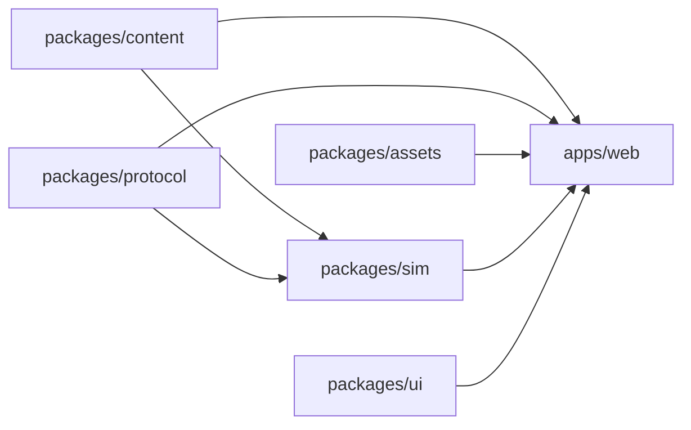
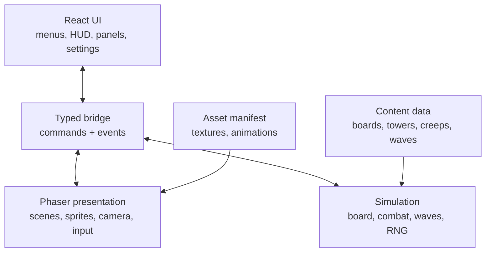

# Architecture Guide

Architecture and implementation guidance for the Gem TD-inspired tower defense clone (`pb-td`).

This document defines the target React + Phaser architecture and the engineering rules that should guide implementation. Existing gameplay specifications remain authoritative for their domains:

| Document                                                         | Owns                                                         |
| ---------------------------------------------------------------- | ------------------------------------------------------------ |
| [`HANDOVER.md`](./HANDOVER.md)                                   | Project vision, gameplay loop, high-level React/Phaser split |
| [`BOARD-AND-MAZE-SPEC.md`](./BOARD-AND-MAZE-SPEC.md)             | Board dimensions, mazing, pathfinding, camera, landmarks     |
| [`TOWER-AND-GEM-SYSTEMS.md`](./TOWER-AND-GEM-SYSTEMS.md)         | Gems, towers, recipes, combat abilities, economy             |
| [`MONSTER-SYSTEMS-DEEP-DIVE.md`](./MONSTER-SYSTEMS-DEEP-DIVE.md) | Creeps, waves, movement, defenses, damage resolution         |
| [`PIXELLAB-ASSET-GENERATION.md`](./PIXELLAB-ASSET-GENERATION.md) | Asset generation, animation contracts, file naming           |

**Status:** Architecture target. The root `package.json` already references workspace apps, but this checkout currently contains docs and root tooling only. Treat package paths below as the intended implementation layout unless a later code commit changes them.

---

## 1. Architecture Goals

| Goal                         | Rule                                                                                                            |
| ---------------------------- | --------------------------------------------------------------------------------------------------------------- |
| **Strict separation**        | React owns UI. Phaser owns rendering and scene input. Simulation owns gameplay truth.                           |
| **Content-driven gameplay**  | Board, gem, tower, creep, wave, recipe, and armor data live in content files, not scene code.                   |
| **Deterministic simulation** | Combat, pathing, RNG, waves, rewards, and leaks must be reproducible from state + seed.                         |
| **Fast feedback**            | Core gameplay rules are testable without opening a browser or starting Phaser.                                  |
| **KISS**                     | Prefer direct, readable modules until repeated complexity proves an abstraction is needed.                      |
| **DRY where it matters**     | Keep formulas, schemas, event names, and content IDs single-sourced. Do not over-abstract simple UI.            |
| **Performance by design**    | Cache paths, pool projectiles, avoid React re-renders during frame loops, and load heavy code only when needed. |

The most important boundary: **the Phaser scene is not the game engine**. Phaser is the presentation runtime for a game state owned by simulation modules.

---

## 2. Target Workspace Layout

```text
apps/
  web/                 # React app, Phaser canvas host, player UI
  admin/               # Optional content/debug tools
  game-server/         # Optional authoritative multiplayer server

packages/
  sim/                 # Deterministic gameplay systems
  content/             # Static game data and validation schemas
  protocol/            # Shared event/state contracts
  assets/              # Asset manifest, generated sprite metadata
  ui/                  # Optional shared React UI components
```

### 2.1 Package Responsibilities

| Package             | Owns                                                                                           | Must not own                                                               |
| ------------------- | ---------------------------------------------------------------------------------------------- | -------------------------------------------------------------------------- |
| `apps/web`          | React screens, Phaser bootstrapping, browser input shell, HUD, panels                          | Combat formulas, pathfinding authority, content constants copied from JSON |
| `packages/sim`      | Board state, build validation, path cache, waves, creep movement, tower targeting, damage, RNG | React hooks, Phaser sprites, DOM, browser storage                          |
| `packages/content`  | JSON/data modules, schemas, IDs, balance tables, route definitions                             | Runtime entity state, scene objects                                        |
| `packages/protocol` | Typed events, serializable state snapshots, multiplayer sync shapes                            | Business logic or rendering logic                                          |
| `packages/assets`   | Asset manifest, animation frame metadata, texture keys                                         | Gameplay stats                                                             |
| `apps/game-server`  | Authoritative room/session loop if multiplayer lands                                           | Presentation, local-only UI assumptions                                    |

### 2.2 Dependency Direction



Rules:

- `packages/sim` can depend on `packages/content` and `packages/protocol`.
- `apps/web` can depend on all shared packages.
- Shared packages must not depend on `apps/web`.
- `packages/sim` must not import from Phaser, React, or browser-only APIs.
- `packages/content` must not import from runtime packages.

---

## 3. Runtime Layers



### 3.1 Ownership Matrix

| Concern                                          | Owner                                                          |
| ------------------------------------------------ | -------------------------------------------------------------- |
| Gold, lives, wave number as authoritative values | `packages/sim`                                                 |
| Gold/lives/wave labels shown to player           | React                                                          |
| Board walkability and buildability               | `packages/sim` using `packages/content`                        |
| Placement ghost sprite and grid overlay          | Phaser                                                         |
| Placement validity                               | `packages/sim`                                                 |
| Camera pan, zoom, bounds                         | Phaser                                                         |
| Menu state, recipe dictionary, settings          | React                                                          |
| Projectile movement authority                    | `packages/sim` for hit timing; Phaser for visual interpolation |
| Damage formulas                                  | `packages/sim`                                                 |
| Sprite depth, animation, particles               | Phaser                                                         |
| Asset keys and animation frame names             | `packages/assets` or `packages/content` manifest               |

When there is doubt, put durable gameplay truth in `packages/sim` and visual state in Phaser.

---

## 4. React Best Practices

React is the UI shell and state subscriber. It should be boring, stable, and mostly unaware of frame-by-frame gameplay internals.

### 4.1 React Owns

- App route/layout shell.
- Main menu, pause menu, settings, help, recipe dictionary.
- HUD values derived from simulation snapshots.
- Build phase controls: keep gem, combine, probability upgrades, targeting mode selectors.
- Debug panels in development builds.
- Browser persistence for user preferences only.

React does not own:

- `requestAnimationFrame` gameplay loops.
- Per-creep or per-projectile position updates.
- Pathfinding.
- Damage resolution.
- Phaser object lifecycles.

### 4.2 State Subscription Rules

- Subscribe to coarse simulation snapshots, not every internal entity mutation.
- Use derived selectors so a component only receives the fields it renders.
- Keep frequently changing values out of global React state when Phaser can render them directly.
- Use refs for transient event handlers and bridge objects that should not cause re-renders.
- Clean up every bridge subscription in `useEffect` cleanup.

```ts
useEffect(() => {
  const unsubscribe = gameBridge.onSnapshot((snapshot) => {
    setHudState(selectHudState(snapshot))
  })

  return unsubscribe
}, [gameBridge])
```

### 4.3 Avoid Async Waterfalls

- Start independent async work together and await it together.
- Defer awaiting until the branch actually needs the result.
- Load board data, asset manifests, and user settings in parallel where possible.
- Preload the next heavy panel or recipe dictionary on hover/focus when it improves perceived speed.

```ts
const [board, manifest, settings] = await Promise.all([
  loadBoard(boardId),
  loadAssetManifest(),
  loadUserSettings(),
])
```

### 4.4 Bundle Rules

- Import directly from modules; avoid broad barrel imports for heavy libraries.
- Dynamically import Phaser boot code only on screens that need the game canvas.
- Dynamically import admin/debug panels.
- Load analytics and non-critical third-party scripts after hydration.
- Keep shared `packages/ui` components lightweight and free of Phaser imports.

### 4.5 Rendering Rules

- Do not define React components inside React components.
- Use primitive dependencies in effects and memos.
- Derive simple state during render instead of mirroring it through effects.
- Use `startTransition` for non-urgent UI updates caused by game events.
- Memoize expensive panels, not simple labels.
- Avoid passing large entity arrays into React if Phaser already renders those entities.

---

## 5. Phaser Best Practices

Phaser owns the canvas and the moment-to-moment presentation of the game world. Keep Phaser scenes focused on rendering, animation, input translation, and visual effects.

### 5.1 Scene Boundaries

Recommended scene layout:

```text
BootScene          # Phaser config checks, global setup
PreloadScene       # asset manifest load, progress events
BoardScene         # terrain, structures, units, projectiles, camera
HudBridgeScene     # optional scene-level event bridge for UI-facing events
DebugScene         # dev-only overlays and tools
```

Inside `BoardScene`, split large responsibilities into plain classes:

```text
BoardScene
  CameraController
  TerrainLayer
  LandmarkLayer
  StructureLayer
  UnitLayer
  ProjectileLayer
  BuildOverlayLayer
  SceneInputController
```

These classes may use Phaser APIs, but they should not contain gameplay formulas.

### 5.2 Phaser Owns

- Terrain tilemaps and grass rendering.
- Landmark, tower, rock, creep, projectile, and FX sprites.
- Sprite animation and frame selection.
- Depth sorting and pixel-art render config.
- Pointer-to-world and world-to-grid translation for input.
- Camera pan, bounds, and optional debug overlays.
- Visual interpolation between simulation ticks.

### 5.3 Phaser Does Not Own

- Whether a placement is legal.
- Which creep receives damage.
- How much damage is dealt.
- Wave spawn authority.
- Player economy.
- Gem probability rolls.
- Recipe availability.

### 5.4 Performance Rules

- Use `render.pixelArt = true` and `roundPixels = true`.
- Use `Graphics` or tile-based drawing for grid overlays; do not create one object per grid cell.
- Pool projectiles, hit sparks, floating labels, and short-lived effects.
- Destroy or recycle sprites when entities leave the simulation.
- Use `Group` or custom pools for high-volume objects.
- Recalculate A\* paths only when the maze changes.
- Avoid per-frame allocation in `update`; reuse vectors and arrays in hot paths.
- Depth sort by `y` for structures and units, but avoid full resort work unless positions changed.
- Keep debug overlays behind development flags.

### 5.5 Asset Loading

- Load from a manifest so texture keys are validated before use.
- Use stable texture keys that match content IDs where possible.
- Keep animation definitions close to the asset manifest, not scattered across scenes.
- Fail loudly in development when an asset key is missing.
- Preload the vertical slice assets first; defer later wave assets if needed.

---

## 6. Simulation Best Practices

The simulation is the source of truth. It must be testable in Node without React, Phaser, DOM, or browser APIs.

### 6.1 Sim Owns

- Match state and phase transitions.
- Board occupancy, buildability, and walkability.
- Anti-block validation.
- Path cache and path progress.
- Gem rolls and probability upgrades.
- Recipe checks and combine resolution.
- Tower targeting and attack cadence.
- Projectile hit authority.
- Damage resolution and status effects.
- Wave spawning, creep movement, leaks, rewards.
- Deterministic RNG.

### 6.2 Tick Order

Use one explicit tick pipeline. Keep it readable and stable.

```text
1. Apply queued player commands
2. Advance phase timers
3. Spawn creeps
4. Advance status effects
5. Move creeps
6. Acquire tower targets
7. Fire attacks
8. Move/resolve projectiles
9. Apply damage and deaths
10. Apply leaks and rewards
11. Emit snapshot/events
```

### 6.3 Determinism Rules

- Use a seeded RNG owned by the simulation.
- Do not call `Math.random()` in gameplay systems.
- Pass `dt` into ticks; do not read wall-clock time inside systems.
- Keep content definitions immutable during a match.
- Store IDs and scalar state in snapshots; avoid storing class instances in serializable state.
- Make path cache invalidation explicit and versioned.

### 6.4 Pathfinding Rules

- Use per-leg A\* through ordered waypoints.
- Disable diagonal movement unless a future board spec changes it.
- Validate every route leg before accepting a placement.
- Cache paths after maze changes.
- Creeps follow cached world coordinates and track scalar progress.
- Tower "closest to goal" targeting uses path progress, not Euclidean distance to the goal.

---

## 7. React and Phaser Bridge

React and Phaser communicate through a typed bridge. Avoid direct cross-layer imports beyond the bridge setup.

### 7.1 Command Flow

React sends player intent:

```ts
type GameCommand =
  | { type: 'build.startPlacement' }
  | { type: 'build.placeGem'; gx: number; gy: number }
  | { type: 'build.keepGem'; placementId: string }
  | { type: 'recipe.combine'; recipeId: string; anchorId: string }
  | { type: 'tower.setTargetingMode'; towerId: string; mode: TargetingMode }
  | { type: 'tower.setHoldFire'; towerId: string; held: boolean }
  | { type: 'economy.upgradeGemChance' }
  | { type: 'game.pause'; paused: boolean }
```

Phaser sends world interaction intent:

```ts
type WorldInputCommand =
  | { type: 'pointer.hoverFootprint'; gx: number; gy: number }
  | { type: 'pointer.placeAtHoveredFootprint' }
  | { type: 'pointer.selectStructure'; structureId: string }
  | { type: 'camera.focusLandmark'; landmarkId: string }
```

Simulation emits snapshots and events:

```ts
type GameEvent =
  | { type: 'phase.changed'; phase: GamePhase }
  | { type: 'hud.changed'; gold: number; lives: number; wave: number }
  | { type: 'placement.validityChanged'; valid: boolean; reason?: string }
  | { type: 'path.rebuilt'; version: number }
  | { type: 'creep.died'; creepId: string; towerId?: string }
  | { type: 'creep.leaked'; creepId: string; livesRemaining: number }
```

### 7.2 Bridge Rules

- Define event and command types in `packages/protocol`.
- Do not use stringly typed ad hoc event names inside components or scenes.
- Keep bridge payloads serializable.
- Prefer commands over direct method calls from React into Phaser internals.
- Unsubscribe on component unmount and scene shutdown.
- Never put the Phaser `Game` instance in broad React state.
- Keep one owner for bridge construction and teardown.

### 7.3 Lifecycle

```text
React GameRoute mounts
  create GameBridge
  create Phaser.Game with bridge dependency
  create or load Simulation instance

React GameRoute unmounts
  stop simulation loop
  remove bridge subscriptions
  destroy Phaser.Game
  release large asset/debug references
```

---

## 8. Content and Schema Rules

Content is the contract between design and runtime. It should be easy to validate and hard to misuse.

### 8.1 Single Source of Truth

Keep these values in content/schema files, not duplicated in scenes:

- Board size, tile size, waypoint positions, and unbuildable zones.
- Gem IDs, quality tiers, base stats, ability parameters.
- Tower IDs, recipes, and combine inputs.
- Enemy IDs, movement class, base stats, defenses, rewards.
- Wave schedules and modifiers.
- Armor and damage multiplier matrix.
- Asset keys and animation IDs.

### 8.2 Validation

Every content file should be validated before use:

- IDs are unique.
- Referenced IDs exist.
- Recipes reference valid gem/tower IDs.
- Wave entries reference valid enemy IDs.
- Asset keys referenced by content exist in the manifest.
- Board route legs reference valid landmarks.
- Numeric values are finite and in expected ranges.

Validation should run in tests and in development startup.

---

## 9. KISS Rules

KISS means the simplest design that preserves the right boundaries.

Do:

- Start with plain functions for formulas.
- Keep modules small and named after gameplay concepts.
- Use explicit command/event types.
- Prefer boring data structures over clever class hierarchies.
- Keep first implementations readable before making them generic.
- Build vertical slices that prove the loop end to end.

Avoid:

- Generic entity-component frameworks before the game needs one.
- Abstract factory layers around every tower or monster.
- A global event bus with undocumented string events.
- Scene code that becomes a second simulation.
- React state managers for values that only Phaser renders.
- Premature multiplayer abstractions in local-only systems.

Good default: if a new abstraction does not remove real duplication or clarify ownership, wait.

---

## 10. DRY Rules

DRY is most important for contracts and formulas. It is less important for early UI shape.

### 10.1 Must Be DRY

- Content IDs.
- Command and event names.
- Damage formulas.
- Armor matrix lookups.
- Gem probability tables.
- Board coordinate conversions.
- Path cache versioning.
- Asset texture keys.
- Schema definitions.

### 10.2 Duplication Allowed Temporarily

- Two React panels can have similar layout before a shared component proves useful.
- Two Phaser visual effects can start as separate classes while their behavior is still changing.
- Test fixtures can repeat small data when it makes test intent clearer.

### 10.3 When To Abstract

Abstract only when at least one is true:

- The duplicated logic is already stable.
- The duplication risks inconsistent gameplay behavior.
- The abstraction gives a clearer name to a domain concept.
- A shared helper makes tests simpler and more precise.

Do not abstract just because two blocks look similar.

---

## 11. Error Handling and Debuggability

### 11.1 Development Failures

Fail fast in development for:

- Missing content IDs.
- Missing asset keys.
- Invalid board routes.
- Invalid recipe inputs.
- Unhandled command types.
- Phaser scene boot without required bridge dependencies.

### 11.2 Runtime Failures

Player-facing runtime should recover where possible:

- If an optional asset fails, show a fallback texture and log the missing key.
- If a command is invalid, reject it with a typed reason and keep state unchanged.
- If content validation fails in production, block match start with a clear error state.
- If Phaser crashes during boot, React should show a retryable error screen.

### 11.3 Debug Tools

Development-only overlays may show:

- Buildability grid.
- Ground path cache.
- Flying route.
- Creep path progress.
- Tower ranges.
- Target acquisition choices.
- Damage numbers and armor/MR calculations.

Debug overlays must not be part of production gameplay.

---

## 12. Testing Strategy

### 12.1 Unit Tests

Prioritize `packages/sim`:

- Grid coordinate conversion.
- Footprint placement and anti-block validation.
- Path cache invalidation.
- Gem probability rolls with seeded RNG.
- Recipe availability and combine resolution.
- Tower target selection.
- Damage resolution.
- Status effect stacking.
- Wave spawn timing.
- Leak detection.

### 12.2 Content Tests

- Validate all content files.
- Assert every referenced asset key exists.
- Assert every route leg is connected on the default empty board.
- Assert every wave references valid enemies and abilities.
- Assert recipe inputs and outputs exist.

### 12.3 Integration Tests

- Start a match.
- Place five gems.
- Select one gem.
- Resolve four rocks and one tower.
- Rebuild path cache.
- Spawn a wave.
- Kill or leak creeps.
- Advance to next build phase.

### 12.4 Browser Smoke Tests

For `apps/web`:

- App mounts without console errors.
- Phaser canvas appears.
- Asset preload completes.
- Camera can pan.
- Build overlay appears only during placement.
- React HUD updates from simulation snapshots.
- Unmount destroys Phaser without leaking listeners.

---

## 13. Implementation Order

Recommended vertical-slice order:

1. Create workspace packages and dependency direction.
2. Add content schemas and minimal board/gem/enemy/wave data.
3. Implement `packages/sim` board state, placement validation, and seeded RNG.
4. Add pathfinding and path cache.
5. Add basic wave, creep movement, tower targeting, and damage.
6. Add `apps/web` React shell and Phaser canvas boot.
7. Add typed bridge between React, Phaser, and simulation.
8. Render board, grid, structures, creeps, and projectiles.
9. Add HUD, build controls, targeting controls, and recipe panel.
10. Add tests and content validation around each shipped system.

Keep each step playable or testable before broadening scope.

---

## 14. Code Review Checklist

Use this checklist when adding or reviewing architecture-sensitive changes:

- Does the code put gameplay truth in `packages/sim`?
- Does Phaser only render, animate, and translate scene input?
- Does React subscribe to coarse state instead of frame-loop data?
- Are content IDs and formulas single-sourced?
- Are bridge events typed and cleaned up?
- Can the core logic run in tests without a browser?
- Does this abstraction remove real complexity?
- Is pathfinding cached and invalidated intentionally?
- Are projectiles/effects destroyed or pooled?
- Are expensive imports loaded only where needed?
- Is error handling explicit for invalid commands and missing content?

---

## 15. Changelog

| Date       | Change                                                                |
| ---------- | --------------------------------------------------------------------- |
| 2026-06-30 | Initial architecture guide for React, Phaser, KISS, and DRY practices |
