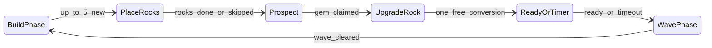

# Project Facet — Development Backlog

Authoritative backlog for **Project Facet**: a browser-based GemTD-style tower defense with maze building, gem merging, combination towers, and shared-seed competitive races.

**Repo:** `pb-td` (rename optional)  
**Companion:** [PIXELLAB-ASSET-TRACKER.md](./PIXELLAB-ASSET-TRACKER.md)  
**Last updated:** 2026-06-28  
**Phase 0 progress:** complete  
**Phase 1 progress:** core sim + UI + auth scaffold (see table below)

---

## North star

Project Facet is a desktop-first browser game for 1–4 friends in private rooms. Players build mazes from rocks and towers, choose from shared gem offers, merge and combine towers, and survive escalating waves. Standard Race gives each player an identical board seed and offer sequence while competing on lives, wave reach, and build quality.

### First private launch (done-state)

- 1–4 players, private invite links, 24-wave Standard Race (+ 12-wave short mode)
- Eight gem families, four combination towers, dual placement (rocks + towers)
- Deterministic pathfinding, authoritative Colyseus simulation
- Firebase Google auth, reconnect, replays, match history
- Original pixel art (transparent PNG), complete tooltips, no account power
- Ten clean multiplayer matches without desync before friend release

### Non-goals (v1)

- Public matchmaking, ranked ladder, mobile-first UI
- Persistent power progression, loot boxes, battle passes
- User-generated maps, voice chat, in-game friend system, hero units
- Full clone of another game's content or naming

---

## Design pillars

Every epic should pass these checks:

1. **Maze construction is primary skill** — routing matters as much as DPS.
2. **Randomness creates decisions, not wins** — shared offers, visible odds, limited costly rerolls.
3. **No account power** — cosmetics and history only; never stronger towers or economy.
4. **Information is visible** — tooltips show damage, range, tags, merge results, recipes.

---

## Grill session decisions (locked)

These override ambiguous parts of the original design doc.

| Topic | Decision |
|-------|----------|
| Maze model | **Dual placement** — rocks and gem towers both block ground pathing |
| Rock economy | **5 new rocks per build phase** (free). Rocks **persist** across waves |
| Build phase order | **Rocks → Prospect → Upgrade** |
| Tower growth | **1 new tower per build phase** via free rock→gem upgrade; power from **merges** |
| Merge (Phase 1) | On-board, anytime in build phase: 2 identical → +1 tier |
| Merge (Phase 2) | Add 4→+2 tier + undo before next wave |
| Board size | **28×20** from Phase 1 |
| Monorepo | **Phase 0** — sim in `packages/sim` before slice |
| Legacy purge | **Phase 1 start** (PF-1.0) — before new features |
| Phase 0 gate | Full contract **blocks** Phase 1 code |
| Determinism | **Phase 1 exit** (PF-1.12) — floats OK during slice |
| Flyers | Straight **spawn→exit aerial lane**; Phase 2 |
| Crystal Dust | Full economy Phase 2 |
| Auth | **Firebase Google OAuth from Phase 1** — solo requires login |
| Hosting | **Firebase Hosting** (web) + **Colyseus** (Cloud Run or homelab) |
| Match DB | PostgreSQL **or** Firestore — decide in Phase 0 infra doc |
| Persistence | Match history + replays + cosmetic unlocks only |
| Rock mistakes | **Sell rocks** during build phase for partial gold refund |
| Rerolls | **Unlimited** while gold lasts: 10 → 20 → 40 → 80 → 160… |
| Gold sinks (Phase 1) | Rerolls + combination costs |
| Assets | Pixel art, **transparent PNG**, PixelLab pipeline |

### Build phase FSM



---

## Current state → target

| Area | Today (`pb-td`) | Target (Project Facet) |
|------|-----------------|------------------------|
| Structure | Single Vite app, `src/game/` | Monorepo: `apps/web`, `apps/game-server`, `packages/*` |
| Board | 16×10, checkerboard parity | 28×20 terrain map; rocks + towers block |
| Build loop | Shop, lucky box, random buy | 5 rocks → prospect → 1 free upgrade |
| Gems | 5 families, L1–L7 | 8 families (Flame…Arcane), T1–T5 |
| Combos | None | 4 at launch |
| Economy | Stars/crowns meta | Gold + Crystal Dust; merges = power |
| Waves | 50 waves, 3 areas | 24-wave Standard Race |
| Multiplayer | None | Colyseus + Firebase Auth |
| Auth | None | Google OAuth Phase 1 |

---

## Code migration map

### Keep (refactor into monorepo)

| Asset | Current path | Target |
|-------|--------------|--------|
| Sim pattern | `src/game/engine.ts` | `packages/sim/` — `dispatch`, `tick`, no React/Phaser |
| Types / actions | `src/game/types.ts` | `packages/sim/types.ts` |
| Maze / path | `src/game/maze.ts`, `pathNav.ts`, `pathBuild.ts` | `packages/sim/` — extend for dual blockers + air lane |
| Gem stats | `src/game/gems.ts` | `packages/sim/gems.ts` |
| Phaser scene | `src/phaser/CosmicBoardScene.ts` | `apps/web/src/phaser/BoardScene.ts` |
| Bridge | `src/phaser/bridge.ts` | `apps/web/src/phaser/bridge.ts` |
| React host | `src/components/PhaserGameHost.tsx` | `apps/web/src/components/` |
| Game hook | `src/hooks/useCosmicGame.ts` | `apps/web/src/hooks/useGame.ts` |
| HUD | `src/App.tsx` | `apps/web/src/App.tsx` |
| Tests | `src/game/*.test.ts` | `packages/sim/*.test.ts` |
| Toolchain | `package.json`, `vite.config.ts`, Tailwind | Root + `apps/web` |

### Retire at PF-1.0

| System | Files | Reason |
|--------|-------|--------|
| Starfall missile | `engine.ts`, `App.tsx`, `CosmicBoardScene.ts` | Not GemTD |
| Checkerboard parity | `boardParity.ts`, `boardParity.test.ts` | Terrain map replaces parity |
| Stars/crowns upgrades | `save.ts`, upgrade UI in `App.tsx` | No account power |
| Lucky box / random shop | `content.ts`, `engine.ts` | Prospect system replaces |
| 3-area 50-wave content | `content.ts` | 24-wave Facet schedule |
| Fixed path polylines | `content.ts` area `path[]` | Spawn/goal + maze BFS |
| Cosmic naming/assets | `public/assets/*`, `assetManifest.ts` | Replace per asset tracker |

### New packages / apps

```text
pb-td/
├── apps/
│   ├── web/                 React + Phaser client
│   └── game-server/         Colyseus (Phase 3)
├── packages/
│   ├── sim/                 Deterministic game simulation
│   ├── content/             Gems, enemies, waves, board JSON
│   ├── protocol/            Zod command schemas
│   └── config/              Shared TS/eslint/vitest config
├── infra/                   Docker Compose (Phase 5)
└── docs/
    ├── backlog.md           (this file)
    └── PIXELLAB-ASSET-TRACKER.md
```

---

## Tech stack

| Layer | Choice |
|-------|--------|
| Frontend | React 19, TypeScript, Vite, Tailwind, Zustand (UI only) |
| Board render | Phaser 4 |
| Simulation | `packages/sim` — fixed tick (20 tps), seeded RNG, integer milli-damage |
| Multiplayer | Colyseus, WebSockets, server-authoritative |
| Auth | Firebase Google OAuth |
| Hosting | Firebase Hosting (web); Colyseus on Cloud Run or homelab |
| Persistence | PostgreSQL or Firestore (match + command logs) |
| Tests | Vitest; determinism CI from Phase 1 exit |
| Assets | PixelLab MCP, transparent PNG, 32×32 tiles |

**Architecture rule:** Game rules live only in `packages/sim`. React/Phaser send commands and render state.

---

## Phase roadmap

### Phase 0 — Game contract + monorepo (blocks Phase 1)

**Goal:** Written rules, schemas, board data, monorepo shell.

| ID | Epic | Deliverable | Status |
|----|------|-------------|--------|
| PF-0.1 | Core rules | [game-design.md](./game-design.md) | done |
| PF-0.2 | Visual direction | [ui-wireframes.md](./ui-wireframes.md) | done |
| PF-0.3 | Content schemas | `packages/content` | done |
| PF-0.4 | Waves + board | JSON in `packages/content/data/` | done (slice-6; standard-24 doc only) |
| PF-0.5 | Protocol sketch | `packages/protocol` | done |
| PF-0.6 | Monorepo bootstrap | `pnpm dev` → `apps/web` | done |

**Exit:** No TBD mechanics; monorepo runs locally.

---

### Phase 1 — Vertical slice (solo + Firebase auth)

**Goal:** Prove maze + prospect + merge + combat loop in ~10 minutes.

**PF-1.0** Legacy purge — **done** (Cosmic Siege `game/`, `phaser/` removed).

| ID | Ticket | Status |
|----|--------|--------|
| PF-1.1 | Firebase Google auth | done |
| PF-1.2 | 28×20 board + placement | done |
| PF-1.3 | Rock placement + path validation | done |
| PF-1.4 | Prospect + escalating reroll | done |
| PF-1.5 | Free rock→tower upgrade | done |
| PF-1.6 | Merge + sell | partial |
| PF-1.7 | Enemy movement | done |
| PF-1.8 | Combat + lives + gold | done |
| PF-1.9 | 1 combination tower | done |
| PF-1.10 | 6-wave FSM + boss | done |
| PF-1.11 | Local replay | done (`packages/sim/replay.ts`) |
| PF-1.12 | Determinism hardening | partial |

**Content lock:** 1 board, 3 gem families, 1 combo, 6 waves, 1 boss, ground only.

---

### Phase 2 — Full solo game

| ID | Epic |
|----|------|
| PF-2.1 | 8 gem families × 5 tiers, distinct mechanics |
| PF-2.2 | 4 combination towers + recipe browser |
| PF-2.3 | 24 waves, 8 archetypes, 5 bosses |
| PF-2.4 | Flyer aerial lane (straight line) |
| PF-2.5 | Gold + Crystal Dust (full) |
| PF-2.6 | Merge 4→+2 + undo before wave |
| PF-2.7 | Full HUD + tooltips |
| PF-2.8 | Maze feedback (path length, heatmap, range) — no maze score |
| PF-2.9 | Accessibility (colour-blind, reduced motion, scalable text) |
| PF-2.10 | Replay UI (play/pause/speed/jump wave) |
| PF-2.11 | Sim test suite expansion |

**Exit:** Strategically complete solo; no mandatory gem family.

---

### Phase 3 — Multiplayer

| ID | Epic |
|----|------|
| PF-3.1 | Colyseus server, invite links, 1–4 players, shared seed |
| PF-3.2 | Standard Race (same offers, separate boards) |
| PF-3.3 | Ready timer, speed vote, pause vote |
| PF-3.4 | Reconnect (90s) + spectators; Firebase UID |
| PF-3.5 | Server validation + rate limits |
| PF-3.6 | Match persistence (Postgres or Firestore) |
| PF-3.7 | Server replay verification |
| PF-3.8 | Match history API (TanStack Query) |

**Exit:** Four players finish; replay matches server; history per Google account.

---

### Phase 4 — Content and balance

- Remaining 4 combos, difficulty modifiers, challenge seeds
- `apps/admin` balance dashboard, wave editor, replay browser
- VFX/audio, board themes
- 1,000-seed automated sim runs
- Balance red-flag monitoring (see below)

---

### Phase 5 — Private launch

- Firebase Hosting production + Colyseus production deploy
- `docs/runbook.md` (Firebase + Colyseus split)
- Monitoring, backups, cosmetic unlock persistence
- **Gate:** 10 multiplayer matches without desync/corruption

---

## Content inventory

### Gem families (8)

| Family | Role | Core mechanic |
|--------|------|---------------|
| Flame | DoT | Burn, spread at high tiers |
| Tide | Control | Slow, weaken movement |
| Gale | Chain | Bounce damage, swarm punish |
| Stone | Heavy | Armour break, splash, anti-boss |
| Thorn | Scaling | Stack poison on long routes |
| Radiant | Mark/crit | Amplify damage taken |
| Umbral | Debuff | Curse, boss vulnerability |
| Arcane | Precision | Fast beams, flexible targeting |

Tiers: T1–T5. Merge: 2→+1 tier; 4→+2 tier (Phase 2).

### Launch combinations (4)

| Combo | Inputs | Role |
|-------|--------|------|
| Magma Core | Flame + Stone | Splash, armour shred |
| Tempest Coil | Tide + Gale | Chain slow |
| Wildfire Grove | Flame + Thorn | Spreading burn |
| Prism Array | Radiant + Arcane | Damage amp |

Deferred: Sunforge Bastion, Venom Current, Storm Wraith, Rift Lens.

### Enemy archetypes

| Archetype | Tests |
|-----------|-------|
| Runner | Maze length |
| Swarm | AoE |
| Bulwark | Armour shred |
| Wisp | Damage diversity |
| Leech | Focus fire |
| Flyer | Anti-air (aerial lane) |
| Siege Beast | Leak threat |
| Boss | Wave objective |

### Life damage on leak

| Enemy | Lives |
|-------|------:|
| Standard | 1 |
| Bulwark | 2 |
| Flyer | 1 |
| Siege Beast | 3 |
| Boss | 5 |

Start: 20 lives.

### Wave structure (24)

| Act | Waves | Focus |
|-----|------:|-------|
| I | 1–6 | Maze, first merges |
| II | 7–12 | Armour, swarm, first flyer |
| III | 13–18 | Combos, resistances |
| IV | 19–24 | Bosses, optimization |

Milestones: wave 3 swarm, 5 flyer, 6 mini-boss, 12 major boss, 24 final boss.

### Bosses (initial)

| Boss | Mechanic |
|------|----------|
| The Burrower | Stacking armour without sustained hits |
| The Tempest | Splits into flying fragments |
| The Mirror | Reflects burst damage |
| The Warden | Shields minions |
| The Final Colossus | Alternates armour / speed |

### Commands (multiplayer)

`PLACE_ROCK`, `SELL_ROCK`, `PLACE_TOWER` (via upgrade), `SELL_TOWER`, `SELECT_GEM`, `REROLL_OFFER`, `MERGE_GEMS`, `CREATE_COMBINATION`, `SET_TARGETING`, `READY_FOR_WAVE`, `REQUEST_SPEED`, `VOTE_PAUSE`, `PING_TILE`

Each: `playerId`, `roomId`, `clientSequence`, `commandType`, `payload`.

### Hotkeys

| Key | Action |
|-----|--------|
| Left click | Select |
| Right click | Inspect / cancel |
| Drag | Pan board |
| Wheel | Zoom |
| Space | Ready |
| R | Reroll offer |
| M | Merge |
| C | Combination menu |
| S | Sell |
| 1–3 | Speed request |
| Tab | Scoreboard |
| Esc | Close / cancel |

---

## Asset track (pixel, transparent)

See [PIXELLAB-ASSET-TRACKER.md](./PIXELLAB-ASSET-TRACKER.md) for job IDs. Families in tracker will migrate from Cosmic names to **Flame, Tide, Gale, Stone, Thorn, Radiant, Umbral, Arcane**.

| ID | Epic | Scope |
|----|------|-------|
| PF-A1 | Board tiles | Buildable, blocked, spawn, exit — 32×32 PNG |
| PF-A2 | Gem tiers | 8 families × 5 tiers |
| PF-A3 | Combos | 4 combination sprites |
| PF-A4 | Enemies | 8 archetypes + 5 bosses |
| PF-A5 | UI icons | Families, damage tags, resistances |
| PF-A6 | FX | Projectiles, merge burst, heatmap overlay |

**Style:** Facet/crystal theme — distinct from retired Cosmic Siege void palette.

---

## Testing and quality gates

| Phase | Gate |
|-------|------|
| 0 | Schemas validate sample content JSON |
| 1 | Unit tests: maze, merge, prospect, combat; **determinism test at exit** |
| 2 | Boss mechanics, flyers, combos, win conditions covered |
| 3 | E2E: room, invite, reconnect, replay match server |
| 4 | 1,000-seed sim suite in CI |

**Determinism:** same seed + same commands + same content version = identical final state.

---

## Balance red flags

Investigate when:

- One gem in >70% of winning builds
- A combo never selected
- Wave success <20% or >85%
- Reroll always correct
- Maze path length is only stat that matters
- Win/loss explained only by missing one gem roll

**Metrics per match:** wave reached, gem/combo usage, rerolls, gold spent, path length, leaks per wave, boss time, disconnect rate.

---

## Risks

| Risk | Mitigation |
|------|------------|
| Scope creep | Freeze MVP: 8 gems, 4 combos, 24 waves |
| Phase 1 heavy before fun | Full Phase 0 contract; validate merge curve by wave 3 |
| 1 tower/phase pacing | Design merges as main power spike; playtest early |
| Hybrid infra (Firebase + Colyseus) | Document in runbook |
| Multiplayer desync | Shared sim, command log, replay debugging |
| RNG feels unfair | Shared seed, visible offers, costly rerolls, soft resistances |
| Dominant strategy | Automated seed sims + metrics |
| Legal/creative derivative | Original art, names, recipes, UI |

---

## Ticket numbering

```text
PF-{phase}.{seq}   Engineering epics
PF-A{seq}          Art/assets
PF-B{seq}          Balance/tooling
```

---

## Related docs

| Doc | Status |
|-----|--------|
| [backlog.md](./backlog.md) | Active |
| [game-design.md](./game-design.md) | Phase 0 — done |
| [ui-wireframes.md](./ui-wireframes.md) | Phase 0 — done |
| [content-schema.md](./content-schema.md) | Phase 0 — done |
| [board-default-28x20.md](./board-default-28x20.md) | Phase 0 — done |
| [waves-standard-24.md](./waves-standard-24.md) | Phase 0 — done |
| [infra.md](./infra.md) | Phase 0 — done |
| [PIXELLAB-ASSET-TRACKER.md](./PIXELLAB-ASSET-TRACKER.md) | Active (families updating) |
| `balancing.md` | Phase 4 |
| `runbook.md` | Phase 5 |

---

*Maintained in `docs/backlog.md`. Grill decisions from 2026-06-28 sessions are binding until explicitly revised.*
