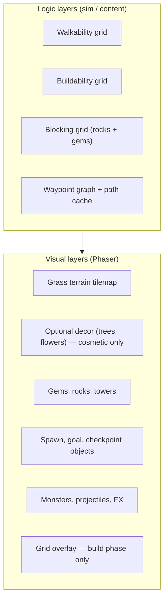

# Board and Maze Specification

Authoritative design for the **playable map**, **mazing grid**, **camera**, **waypoint routing**, and **pathfinding** in the Gem TD-inspired clone (`pb-td`).

This document extends [`HANDOVER.md`](./HANDOVER.md) §2.3 and §5 with concrete rules. It incorporates:

- Classic **Warcraft III Gem TD** map research (≈148×148 playable, 5–7 checkpoints, 2×2 gem footprints, shortest-path routing).
- Project-specific UX: **large pannable map**, **grid only while placing gems**, **no visible creep path**, **grass environment**, **visible landmarks** at spawn, goal, and checkpoints.

**Status:** Design specification. Map JSON and Phaser scene code are not yet committed.

---

## Table of Contents

1. [Design goals](#1-design-goals)
2. [Classic Gem TD reference](#2-classic-gem-td-reference)
3. [Map dimensions and coordinates](#3-map-dimensions-and-coordinates)
4. [Visual vs logical layers](#4-visual-vs-logical-layers)
5. [Camera and navigation](#5-camera-and-navigation)
6. [Grid visibility and build UX](#6-grid-visibility-and-build-ux)
7. [Cell types and build rules](#7-cell-types-and-build-rules)
8. [Landmarks and waypoint route](#8-landmarks-and-waypoint-route)
9. [Mazing and blocking rules](#9-mazing-and-blocking-rules)
10. [Pathfinding and path cache](#10-pathfinding-and-path-cache)
11. [Flying route (invisible path)](#11-flying-route-invisible-path)
12. [Grass environment art direction](#12-grass-environment-art-direction)
13. [Content data schema](#13-content-data-schema)
14. [Phaser implementation notes](#14-phaser-implementation-notes)
15. [Asset implications](#15-asset-implications)
16. [Open decisions](#16-open-decisions)

---

## 1. Design goals

| Goal                   | Spec                                                                                      |
| ---------------------- | ----------------------------------------------------------------------------------------- |
| **Large battlefield**  | Map is much larger than the viewport; player pans to plan mazes.                          |
| **Natural look**       | Grass terrain reads as an open field, not a painted lane TD.                              |
| **Hidden path**        | Creep route is **not** drawn on the ground. Mazing creates the path implicitly.           |
| **Visible key points** | Spawn gate, goal nexus, and numbered checkpoints are always visible landmarks.            |
| **Grid on demand**     | Placement grid appears **only** during gem placement in the build phase.                  |
| **Data authority**     | Walkability and buildability come from the **logic grid**, never from terrain art.        |
| **Gem TD fidelity**    | Shortest-path routing through ordered checkpoints; 2×2 structures; anti-block validation. |

### 1.1 Player experience summary

```text
Combat / explore  →  grass field, landmarks, towers, rocks, monsters — no grid, no path overlay
Build (place gem) →  grid fades in, ghost gem snaps to 2×2 cells, valid/invalid rings
Build (other)     →  grid hidden again during select / resolve / combat
```

---

## 2. Classic Gem TD reference

Research from WC3 Gem TD (v5.x), Gem TD+, and community mazing guides:

| Property            | Classic behavior                                                  | Clone adoption                                             |
| ------------------- | ----------------------------------------------------------------- | ---------------------------------------------------------- |
| Playable area       | ~**148×148** tiles (160×160 total with border)                    | **148×148** logic grid for v1                              |
| Checkpoints         | **5–7** ordered waypoints + spawn + goal                          | **5 checkpoints** v1 (extendable to 7)                     |
| Structure size      | Gems and rocks occupy **2×2** cells                               | **2×2** footprint for gems, rocks, towers                  |
| Routing             | Shortest walkable path between consecutive checkpoints            | Same — A\* per leg                                         |
| Checkpoint blocking | Cannot fully seal a checkpoint                                    | Anti-block validation on every leg                         |
| Unbuildable zones   | Spawn wall, diagonal border, checkpoint pads, final approach lane | Modeled as `unbuildable` cells                             |
| Flying creeps       | Ignore maze; follow fixed aerial route through center **twice**   | Logical spline through checkpoints; **not** drawn on grass |
| Path visibility     | Classic maps sometimes show a gray aerial lane                    | **Intentionally omitted** — landmarks only                 |

**Mazing strategy (classic):** Players surround odd or even checkpoints (often 1, 3, 5), use map walls as borders, and spiral outward from the center cross so towers get maximum exposure time.

---

## 3. Map dimensions and coordinates

### 3.1 Grid constants

```ts
const TILE_SIZE = 32 // pixels per logic cell
const MAP_WIDTH = 148 // logic cells (x)
const MAP_HEIGHT = 148 // logic cells (y)
const WORLD_WIDTH = 4736 // MAP_WIDTH * TILE_SIZE
const WORLD_HEIGHT = 4736
const GEM_FOOTPRINT = 2 // 2×2 cells per gem / rock / tower base
```

### 3.2 Coordinate system

| Space         | Origin               | Axes       | Units                         |
| ------------- | -------------------- | ---------- | ----------------------------- |
| **Grid**      | Top-left `(0, 0)`    | `gx`, `gy` | Integer cells                 |
| **World**     | Top-left `(0, 0)`    | `x`, `y`   | Pixels                        |
| **Footprint** | Top-left cell of 2×2 | `gx`, `gy` | Must be even-aligned (see §7) |

```ts
function gridToWorldCenter(gx: number, gy: number) {
  return {
    x: gx * TILE_SIZE + TILE_SIZE / 2,
    y: gy * TILE_SIZE + TILE_SIZE / 2,
  }
}

function worldToGrid(x: number, y: number) {
  return {
    gx: Math.floor(x / TILE_SIZE),
    gy: Math.floor(y / TILE_SIZE),
  }
}
```

### 3.3 Default map: `crownfall-grass` (v1)

Proposed landmark positions on the 148×148 grid (tunable in content JSON):

| Landmark     | ID             | Grid top-left (gx, gy) | Role                    |
| ------------ | -------------- | ---------------------- | ----------------------- |
| Spawn gate   | `spawn`        | `(8, 124)`             | Creep entry (Point A)   |
| Checkpoint 1 | `checkpoint-1` | `(68, 68)`             | Center cross (main hub) |
| Checkpoint 2 | `checkpoint-2` | `(108, 48)`            | Upper-right arm         |
| Checkpoint 3 | `checkpoint-3` | `(48, 48)`             | Upper-left arm          |
| Checkpoint 4 | `checkpoint-4` | `(108, 88)`            | Lower-right arm         |
| Checkpoint 5 | `checkpoint-5` | `(48, 88)`             | Lower-left arm          |
| Goal nexus   | `goal`         | `(124, 8)`             | Leak target (Point B)   |

```text
                    GOAL (124,8)
                         ★
          CP3 (48,48)              CP2 (108,48)
               ◆                        ◆

                    CP1 (68,68)
                         ◆
          CP5 (48,88)              CP4 (108,88)
               ◆                        ◆

    SPAWN (8,124)
         ⛩
```

**v1 route order** (ground creeps):

```text
spawn → checkpoint-1 → checkpoint-2 → checkpoint-1 → checkpoint-3
      → checkpoint-1 → checkpoint-4 → checkpoint-1 → checkpoint-5
      → checkpoint-1 → goal
```

This is a **superset** of the simplified HANDOVER loop (`Start → WP1 → WP2 → WP1 → End`) and closer to classic multi-checkpoint play. Content can ship a shorter `v1-simple` route with fewer legs for early prototyping.

**Checkpoint pad size:** Each checkpoint occupies a **3×3 unbuildable** cell region centered on the coordinate above (footprint anchor = top-left of pad). Spawn and goal use **4×4** landmark pads.

---

## 4. Visual vs logical layers

The map is split into layers with strict responsibilities.



### 4.1 What players see vs what sim uses

| Element                    |     Visible      |      Affects pathfinding       |
| -------------------------- | :--------------: | :----------------------------: |
| Grass terrain              |        ✓         |               ✗                |
| Trees / decor              |   ✓ (optional)   |               ✗                |
| Spawn / goal / checkpoints |        ✓         |   ✓ (pad cells unbuildable)    |
| Creep path / lane paint    |      **✗**       |          ✓ (computed)          |
| Placement grid             | Build phase only |               ✓                |
| Rocks and gems             |        ✓         |               ✓                |
| Flying route line          |      **✗**       | ✓ (spline through checkpoints) |

**Rule:** If grass art looks like a path, that is cosmetic only. Never use terrain paint to communicate walkability.

### 4.2 Layer render order (bottom → top)

```text
1. Grass terrain tilemap
2. Cosmetic decor (optional, y-sorted)
3. Checkpoint / spawn / goal landmarks
4. Rocks, gems, towers (y-sorted)
5. Monsters + shadows
6. Projectiles and particles
7. Grid overlay + placement rings (build phase only)
8. UI-attached world hints (leak warning, etc.)
```

---

## 5. Camera and navigation

The map (4736×4736 px at 32 px tiles) is **always larger than the viewport**. The camera pans across the grass field; it does not scale the whole map to fit on screen during gameplay.

### 5.1 Viewport assumptions

| Property       | Default                                                    |
| -------------- | ---------------------------------------------------------- |
| Viewport       | 1280×720 (responsive; maintain aspect)                     |
| Initial camera | Centered on **checkpoint-1** (maze heart)                  |
| Zoom           | **0.5–2.0** (default 1.0); mouse wheel toward cursor; `+`/PageUp in, `-`/PageDown out |
| Bounds         | Camera clamped to `[0, WORLD_WIDTH]` × `[0, WORLD_HEIGHT]` |

### 5.2 Mouse panning

| Input                       | Behavior                                     |
| --------------------------- | -------------------------------------------- |
| **Middle mouse drag**       | Pan camera (primary)                         |
| **Space + left mouse drag** | Pan camera (accessibility alternate)         |
| **Mouse at screen edge**    | Optional edge-scroll during build phase only |

During gem placement, panning must not accidentally place gems — require explicit click on a valid cell after panning.

### 5.3 Keyboard panning

| Key       | Action                 |
| --------- | ---------------------- |
| `W` / `↑` | Pan up                 |
| `A` / `←` | Pan left               |
| `S` / `↓` | Pan down               |
| `D` / `→` | Pan right              |
| `Home`    | Jump camera to spawn   |
| `End`     | Jump camera to goal    |
| `C`       | Center on checkpoint-1 |

Pan speed: **900 px/s** held, with acceleration optional in polish pass.

### 5.4 Build-phase camera assist

When the player enters gem placement for the current round:

1. Fade in grid overlay (§6).
2. Optionally **soft-focus** nearest empty buildable region — never force camera; assist only.
3. On invalid hover near map edge, allow edge-scroll.

---

## 6. Grid visibility and build UX

### 6.1 When the grid is visible

| Game phase                       | Grid visible |            Placement rings            |
| -------------------------------- | :----------: | :-----------------------------------: |
| Build — placing gems             |      ✓       | ✓ (`selection-ring` / `invalid-ring`) |
| Build — selecting gem to keep    |      ✗       |                   ✗                   |
| Resolve (gems → rocks)           |      ✗       |                   ✗                   |
| Combat                           |      ✗       |                   ✗                   |
| Free camera explore (if allowed) |      ✗       |                   ✗                   |

### 6.2 Grid overlay spec

| Property       | Value                                         |
| -------------- | --------------------------------------------- |
| Cell size      | 32×32 px (matches `TILE_SIZE`)                |
| Color          | Faint neutral line, ~15% opacity              |
| 2×2 highlight  | Stronger border on hovered footprint          |
| Even alignment | Ghost snaps to `(gx, gy)` where both are even |
| Valid hover    | `selection-ring` at footprint center          |
| Invalid hover  | `invalid-ring` + red ghost tint               |

```ts
// Snap hover to 2×2 footprint top-left (even coordinates)
function snapFootprint(gridX: number, gridY: number) {
  return {
    gx: Math.floor(gridX / 2) * 2,
    gy: Math.floor(gridY / 2) * 2,
  }
}
```

### 6.3 Ghost gem preview

- Semi-transparent gem sprite at snapped footprint.
- Runs anti-block validation (§10) on hover — updates ring color.
- Shows footprint occupancy (2×2 blocked preview) without committing.

---

## 7. Cell types and build rules

### 7.1 Logic cell enum

```ts
type CellKind =
  | 'buildable_grass' // player may place 2×2 gems during build
  | 'blocked' // rock, gem, or tower — impassable + unbuildable
  | 'unbuildable' // border, checkpoint pad, spawn/goal pad, bypass lane
  | 'checkpoint_pad' // unbuildable; must remain reachable
  | 'spawn_pad'
  | 'goal_pad'
  | 'forced_walkable' // bypass corridors (border exploit prevention)
```

### 7.2 Initial board fill

At match start, all interior cells default to `buildable_grass` except:

| Zone                          | Cell kind         | Notes                                                            |
| ----------------------------- | ----------------- | ---------------------------------------------------------------- |
| Map outer border (2-cell rim) | `unbuildable`     | Visual cliff/wall optional                                       |
| Spawn pad                     | `spawn_pad`       | Near `(8, 124)`                                                  |
| Goal pad                      | `goal_pad`        | Near `(124, 8)`                                                  |
| Checkpoint pads ×5            | `checkpoint_pad`  | 3×3 each                                                         |
| Diagonal bypass strip         | `forced_walkable` | Prevents sealing spawn corner (classic)                          |
| Goal approach lane            | `unbuildable`     | Last leg corridor — build alongside, not on (classic WP7→B rule) |

### 7.3 Placement validity (build phase)

A 2×2 footprint at `(gx, gy)` is legal only if:

1. All four cells are `buildable_grass`.
2. Footprint does not overlap landmarks or unbuildable zones.
3. **Anti-block:** temporary place → all route legs still have A\* paths (§10).
4. Player has remaining gem placements this round (max 5).

### 7.4 Resolution phase

When the player selects one gem to keep:

- Chosen footprint → **tower** (`blocked`, attacks).
- Other four placements → **rocks** (`blocked`, passive wall).

Rocks and gems both block ground movement. Towers block movement and shoot.

---

## 8. Landmarks and waypoint route

### 8.1 Visible landmarks

Landmarks are **always rendered** on the grass field:

| Asset ID                        | Visual               | Readable at                       |
| ------------------------------- | -------------------- | --------------------------------- |
| `spawn-gate`                    | Stone gate / portal  | Zoomed out minimap                |
| `goal-nexus`                    | Crystal castle core  | Zoomed out minimap                |
| `checkpoint-1` … `checkpoint-5` | Numbered rune stones | Must read **number** at 100% zoom |

Landmarks are not the path — they are **routing nodes**. Ground creeps path toward node centers; players maze between them.

### 8.2 Waypoint graph

```ts
interface WaypointNode {
  id: string
  grid: { gx: number; gy: number }
  world: { x: number; y: number }
  padSize: number // 3 for CP, 4 for spawn/goal
  landmarkKey: string // Phaser texture key
}

interface RouteLeg {
  from: string
  to: string
}

interface BoardRoute {
  id: string
  groundLegs: RouteLeg[] // ordered A* segments
  flyingNodes: string[] // ordered nodes for aerial spline
}
```

**Default `groundLegs` for `crownfall-grass`:**

```json
[
  { "from": "spawn", "to": "checkpoint-1" },
  { "from": "checkpoint-1", "to": "checkpoint-2" },
  { "from": "checkpoint-2", "to": "checkpoint-1" },
  { "from": "checkpoint-1", "to": "checkpoint-3" },
  { "from": "checkpoint-3", "to": "checkpoint-1" },
  { "from": "checkpoint-1", "to": "checkpoint-4" },
  { "from": "checkpoint-4", "to": "checkpoint-1" },
  { "from": "checkpoint-1", "to": "checkpoint-5" },
  { "from": "checkpoint-5", "to": "checkpoint-1" },
  { "from": "checkpoint-1", "to": "goal" }
]
```

### 8.3 Prototype shortcut route

For early engine tests, ship `crownfall-simple`:

```json
[
  { "from": "spawn", "to": "checkpoint-1" },
  { "from": "checkpoint-1", "to": "checkpoint-2" },
  { "from": "checkpoint-2", "to": "checkpoint-1" },
  { "from": "checkpoint-1", "to": "goal" }
]
```

---

## 9. Mazing and blocking rules

### 9.1 Wall connectivity (classic)

Enemies cannot pass through 2×2 structures. Adjacent structures form walls when:

- **Edge-adjacent** (share a side), or
- **Corner-adjacent** (touching diagonally at corners)

A single 1-cell gap is enough for creeps to squeeze through — mazes should be tight intentionally.

### 9.2 Checkpoint sealing

Players **cannot** place rocks/gems such that any checkpoint becomes unreachable. Validation runs per §10.

Checkpoint **pads** are unbuildable — players cannot accidentally build on the checkpoint itself (classic fairness rule).

### 9.3 Border exploits

Classic maps prevent maze shortcuts along:

| Exploit             | Prevention                                                        |
| ------------------- | ----------------------------------------------------------------- |
| Spawn wall hug      | `unbuildable` + `forced_walkable` bypass strip along spawn edge   |
| Diagonal map border | Unbuildable diagonal band                                         |
| Goal approach       | `unbuildable` lane on final approach — towers may build beside it |

### 9.4 Structure occupancy map

Maintain `blocking[][]` derived from all `blocked` cells:

```ts
function rebuildBlocking(grid: BoardGrid): void {
  for (let gy = 0; gy < MAP_HEIGHT; gy++) {
    for (let gx = 0; gx < MAP_WIDTH; gx++) {
      blocking[gy][gx] = grid.cells[gy][gx] === 'blocked' ? 1 : 0
    }
  }
}
```

Walkability for ground creeps: `0 = walkable`, `1 = blocked`, except `forced_walkable` always `0`.

---

## 10. Pathfinding and path cache

### 10.1 Algorithm

- **Library:** EasyStar.js (A\*).
- **Per leg:** Run from `from` node center → `to` node center on current walkability grid.
- **Diagonal movement:** Disabled (4-directional) for predictable Gem TD mazes.
- **Heuristic:** Manhattan distance.

### 10.2 Anti-blocking validation

On hover / placement attempt:

```ts
function canPlaceFootprint(grid: BoardGrid, gx: number, gy: number): boolean {
  if (!isFootprintBuildable(grid, gx, gy)) return false

  const trial = cloneGrid(grid)
  setFootprint(trial, gx, gy, 'blocked')

  for (const leg of route.groundLegs) {
    const path = findPath(trial, leg.from, leg.to)
    if (path === null) return false
  }
  return true
}
```

UI feedback: invalid ring + disabled click.

### 10.3 Path cache (performance)

> Calculate the path **once** when the maze changes. Creeps follow cached world coordinates.

```ts
interface PathCache {
  version: number
  legs: WorldCoord[][]
  concatenated: WorldCoord[]
  legStartIndex: number[]
  totalLength: number
}
```

**Invalidate** when: build phase resolves (new rocks), gem combine changes footprint, debug map edit.

**Do not invalidate** on: creep death, projectile hit, camera pan.

### 10.4 Path progress

```ts
pathProgress = legIndexOffset + pathIndex + distanceAlongSegment
```

Use for tower targeting "closest to end" (see `HANDOVER.md` §6.1).

---

## 11. Flying route (invisible path)

Flying creeps **ignore** `blocking` grid. They follow a **fixed spline** through waypoint world positions.

### 11.1 Visibility rule

| Classic Gem TD                     | This project                                    |
| ---------------------------------- | ----------------------------------------------- |
| Gray aerial lane sometimes visible | **No lane art** — grass only                    |
| Center crossed twice               | Same logic — spline visits `checkpoint-1` twice |

Players infer the aerial route from **checkpoint positions** and wave announcements ("flying wave").

### 11.2 Flying spline (v1)

```ts
const flyingNodes = [
  'spawn',
  'checkpoint-1',
  'checkpoint-2',
  'checkpoint-1',
  'checkpoint-3',
  'checkpoint-1',
  'goal',
]

// Catmull-Rom or polyline through node world centers
// Sample to ~2px spacing for smooth movement
```

### 11.3 Debug overlay (dev only)

`?debugPaths=1` may draw:

- Ground path polyline (green)
- Flying spline (blue, dashed)

**Never** enabled in production builds.

---

## 12. Grass environment art direction

### 12.1 Visual theme

| Property   | Spec                                                                         |
| ---------- | ---------------------------------------------------------------------------- |
| Biome      | **Grass** — green field, subtle variation                                    |
| Tile       | 32×32 seamless `grass-floor` (replaces stone `default-floor` in art tracker) |
| Path tiles | **Not used visually** in v1                                                  |
| Mood       | Open meadow with crystal landmarks — not dungeon stone                       |

### 12.2 Terrain tiles (v1)

| ID                | Purpose                              | Visible       |
| ----------------- | ------------------------------------ | ------------- |
| `grass-floor`     | Buildable meadow                     | ✓             |
| `grass-variant-a` | Break repetition (optional autotile) | ✓             |
| `grass-edge`      | Map border blend (optional)          | ✓             |
| `blocked-floor`   | Debug / editor only                  | ✗ in shipping |
| `path-floor`      | **Not rendered** — logic/debug only  | ✗             |

### 12.3 Decor (optional, cosmetic)

- Small flowers, stones, tufts — **do not** affect grid.
- Place with density cap so readability stays high.
- Avoid decor on checkpoint pads and spawn/goal.

### 12.4 Landmark contrast

Landmarks must pop against grass:

- Spawn gate: stone + portal glow.
- Goal nexus: crystal / gold core.
- Checkpoints: numbered stone runes, darker base ring.

---

## 13. Content data schema

```ts
// packages/content/src/boards/crownfall-grass.json

interface BoardDefinition {
  id: string
  displayName: string
  tileSize: number
  width: number
  height: number

  terrain: {
    baseTileKey: string // "terrain.grass-floor"
    decorKeys?: string[]
  }

  landmarks: WaypointNode[]
  route: BoardRoute

  zones: {
    unbuildable: GridRect[]
    forcedWalkable: GridRect[]
    goalApproachLane: GridRect[]
    diagonalBypass: GridRect[]
  }

  camera: {
    startFocus: string // "checkpoint-1"
    bounds: [number, number, number, number]
  }
}

interface GridRect {
  gx: number
  gy: number
  w: number
  h: number
}
```

Ship two route profiles in content:

- `crownfall-grass` — full checkpoint loop (production).
- `crownfall-simple` — shortened loop (engine QA).

---

## 14. Phaser implementation notes

### 14.1 Scene structure

```text
BoardScene
├── CameraController      (pan, bounds, keyboard)
├── TerrainLayer          (grass tilemap, no path paint)
├── DecorLayer            (optional)
├── LandmarkLayer         (spawn, goal, checkpoints)
├── StructureLayer        (gems, rocks, towers — y-sort)
├── UnitLayer             (monsters)
├── FxLayer               (projectiles, particles)
└── BuildOverlayLayer     (grid + rings — visible build-place only)
```

### 14.2 Grid overlay implementation

```ts
class BuildOverlayLayer extends Phaser.GameObjects.Container {
  setVisibleForPhase(phase: GamePhase, subphase: BuildSubphase) {
    const show = phase === 'build' && subphase === 'placing'
    this.setVisible(show)
  }
}
```

Draw grid with `Graphics` object or pre-baked tile sprite — avoid 21,904 individual GameObjects (148²).

### 14.3 Landmark placement

```ts
landmark.setOrigin(0.5, 1.0)
landmark.setDepth(landmark.y + LANDMARK_DEPTH_OFFSET)
```

### 14.4 Pixel art config

```ts
render: { pixelArt: true, roundPixels: true }
```

---

## 15. Asset implications

Updates to the art pipeline based on this spec:

| Change                     | Action                                                              |
| -------------------------- | ------------------------------------------------------------------- |
| Grass replaces stone floor | Generate `grass-floor` as primary terrain                           |
| No visible path            | **Do not** ship `path-floor` in v1 visuals; keep for debug optional |
| Landmarks required         | Prioritize `spawn-gate`, `goal-nexus`, `checkpoint-1`–`5`           |
| Grid rings                 | `selection-ring`, `invalid-ring` for build UX                       |
| Large map                  | Tilemap size 148×148; test camera pan early                         |

See [`PIXELLAB-ASSET-GENERATION.md`](./PIXELLAB-ASSET-GENERATION.md) §9 and asset tracker environment section when merged.

---

## 16. Open decisions

|   # | Question                                                        | Recommendation                                         |
| --: | --------------------------------------------------------------- | ------------------------------------------------------ |
|   1 | Full 5-checkpoint loop vs simple 3-leg route for first playable | Start `crownfall-simple`, switch to full loop for beta |
|   2 | Minimap for large map                                           | Yes — react overlay showing landmarks + camera rect    |
|   3 | Zoom levels                                                     | Defer — fixed 1.0 until playtest                       |
|   4 | 7 checkpoints (SC2 layout)                                      | Content schema supports N nodes; art ships 5 first     |
|   5 | Decor density                                                   | Low for v1 — readability over beauty                   |
|   6 | Edge scroll vs only keyboard/middle-mouse                       | Build phase edge scroll optional                       |

---

## Related documents

| Document                                                         | Relevance                                             |
| ---------------------------------------------------------------- | ----------------------------------------------------- |
| [`HANDOVER.md`](./HANDOVER.md)                                   | Core loop, pathfinding pitfalls, grid snapping        |
| [`TOWER-AND-GEM-SYSTEMS.md`](./TOWER-AND-GEM-SYSTEMS.md)         | Gem/tower footprints, rocks, combat range conventions |
| [`PIXELLAB-ASSET-GENERATION.md`](./PIXELLAB-ASSET-GENERATION.md) | Environment asset prompts and paths                   |
| [`MONSTER-SYSTEMS-DEEP-DIVE.md`](./MONSTER-SYSTEMS-DEEP-DIVE.md) | Creep path following, flying vs ground                |

---

## Changelog

| Date       | Change                                                                                               |
| ---------- | ---------------------------------------------------------------------------------------------------- |
| 2026-06-30 | Initial spec: 148×148 grass map, pannable camera, hidden path, visible landmarks, 5-checkpoint route |
