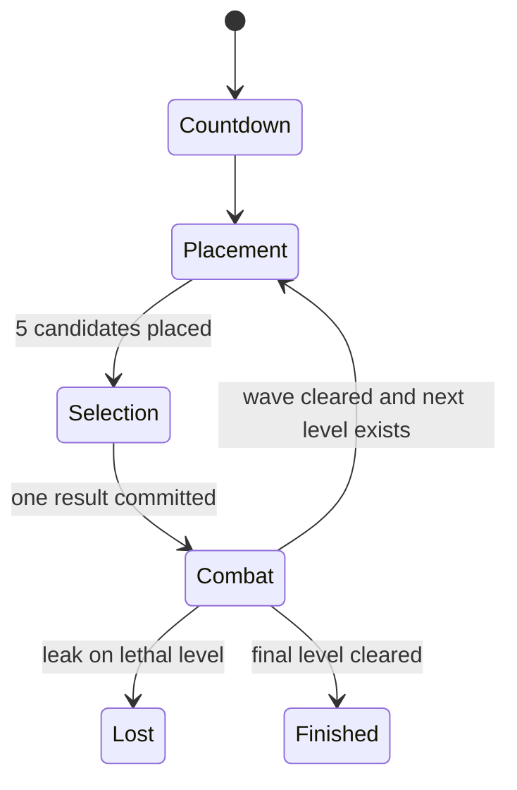

# Gem TD Gameplay Systems Deep Dive

Implementation reference for building Gem TD-style systems in the `pb-td` JavaScript app.

This document describes how the original Gem TD gameplay works as mechanics, state, and data flows. It intentionally avoids source-code references and focuses on what the app needs to implement: placement, selection, gem probability, recipes, slates, waves, leaks, kill growth, and ranking.

**Status:** Gameplay reference for a JavaScript/TypeScript implementation. Use this alongside [`TOWER-AND-GEM-SYSTEMS.md`](./TOWER-AND-GEM-SYSTEMS.md), [`BOARD-AND-MAZE-SPEC.md`](./BOARD-AND-MAZE-SPEC.md), and [`MONSTER-SYSTEMS-DEEP-DIVE.md`](./MONSTER-SYSTEMS-DEEP-DIVE.md).

---

## Table of Contents

1. [Core Identity](#1-core-identity)
2. [Runtime Shape for the JavaScript App](#2-runtime-shape-for-the-javascript-app)
3. [Core Game State](#3-core-game-state)
4. [Round Lifecycle](#4-round-lifecycle)
5. [Placement Phase](#5-placement-phase)
6. [Selection Phase](#6-selection-phase)
7. [Gem Types, Qualities, and Probability](#7-gem-types-qualities-and-probability)
8. [Extra Chance](#8-extra-chance)
9. [Recipes and Combining](#9-recipes-and-combining)
10. [Slates](#10-slates)
11. [Waves, Movement, and Leaks](#11-waves-movement-and-leaks)
12. [Tower Growth and Kill Bonuses](#12-tower-growth-and-kill-bonuses)
13. [Progress, Ranking, and Scoreboard](#13-progress-ranking-and-scoreboard)
14. [JavaScript Data Contracts](#14-javascript-data-contracts)
15. [Implementation Checklist](#15-implementation-checklist)

---

## 1. Core Identity

Gem TD is a tower defense where the maze and the towers are created from the same actions.

The player does not choose a tower from a shop. Instead, each build round gives the player five random gem candidates. The player places all five, then chooses one result to keep. The other four become rocks. Over time, the board fills with a mixture of attacking towers and inert blockers, forming the maze.

### 1.1 The signature 5-to-1 loop

1. Start a build phase.
2. Give the player 5 placement charges.
3. The player places 5 temporary gem candidates on legal build cells.
4. Each placement rolls a random gem immediately.
5. After the fifth placement, show all valid selection actions.
6. The player keeps or transforms exactly one candidate.
7. The selected result becomes the committed tower, special, or slate.
8. The four unselected candidates become rocks.
9. Existing towers reactivate.
10. The next wave starts.

This loop is the core of Gem TD. The random roll creates tactical options, but the placement creates long-term maze commitment.

### 1.2 What makes it different from a normal TD

| Standard TD | Gem TD-style app |
| --- | --- |
| Player buys a known tower. | Player places unknown/random candidates. |
| Tower slots are often fixed. | The player builds the maze layout. |
| Bad tower choices can often be skipped. | Bad candidates still become rocks and affect pathing. |
| Upgrades are mostly direct power buys. | Probability upgrades change future roll quality. |
| Recipes are usually menu actions. | Recipes depend on rolled candidates and kept towers. |

### 1.3 Design principles

| Principle | Meaning |
| --- | --- |
| RNG with agency | The player cannot control every roll, but can choose where candidates appear and which outcome to commit. |
| Maze pressure | Every committed tower and rock changes monster pathing. |
| Recipes reward memory | The player should remember which pieces are on the board and plan future keeps. |
| Selection clarity | After five placements, all legal actions must be obvious and deterministic. |
| Per-player independence | Each player can have a separate level, maze, wave state, and probability table. |

---

## 2. Runtime Shape for the JavaScript App

The JavaScript app should not copy old map scripting concepts directly. It should model the same mechanics using explicit app systems.

### 2.1 Recommended layers

| Layer | Owns |
| --- | --- |
| Content data | Gem definitions, quality table, recipe definitions, slate definitions, wave definitions, monster definitions. |
| Simulation | Round phase, path validation, weighted rolls, tower commitment, monster movement, damage, leak/clear logic. |
| Presentation | Phaser sprites, animations, effects, tooltips, candidate markers, path overlays. |
| UI | Build/selection controls, probability upgrades, Extra Chance menus, recipe dictionary, scoreboard. |
| Persistence/network | Save state, replay seed, multiplayer sync, leaderboard validation. |

### 2.2 System ownership

| System | Responsibility |
| --- | --- |
| `RoundController` | Moves a player through placement, selection, combat, clear, loss, and finish. |
| `PlacementSystem` | Validates build cells, consumes placement charges, creates candidate gems. |
| `GemRoller` | Uses player probability state and Extra Chance overrides to roll gem candidates. |
| `SelectionResolver` | Computes legal keep, downgrade, duplicate combine, one-hit, and slate actions. |
| `RecipeSystem` | Tracks persistent recipe parts and creates special towers. |
| `SlateSystem` | Detects slate opportunities and handles slate combinations. |
| `WaveSpawner` | Spawns monsters for a player's current level. |
| `PathingSystem` | Validates placement and computes routes for ground monsters. |
| `CombatSystem` | Resolves targeting, projectiles, damage, status effects, and kill credit. |
| `ScoreboardSystem` | Computes level, gold, DPS, progress, rank, and finish state. |

### 2.3 Determinism requirement

All gameplay-affecting randomness should go through a seeded RNG owned by the simulation.

Use it for:

- gem candidate rolls,
- Extra Chance override generation,
- boss variant selection,
- any random tower proc that affects combat.

Do not use `Math.random()` inside Phaser display code for anything authoritative.

---

## 3. Core Game State

### 3.1 Player run state

Each player needs an independent run state. Even in multiplayer, players are racing parallel boards rather than sharing one global wave.

```ts
type PlayerRunState = {
  playerId: string;
  phase: "countdown" | "placement" | "selection" | "combat" | "finished" | "lost";
  level: number;
  gold: number;
  placementCharges: number;
  chanceLevel: number;
  noMazeMode: boolean;
  extraChance: ExtraChanceState;
  candidates: CandidateGem[];
  towers: TowerEntity[];
  rocks: RockEntity[];
  activeCreeps: CreepEntity[];
  roundStats: RoundStats;
  history: LevelHistory[];
};
```

### 3.2 Board entities

| Entity | Created when | Blocks path | Attacks | Temporary |
| --- | --- | :---: | :---: | :---: |
| Candidate gem | During placement | Yes | No | Yes |
| Tower | Selection commits a gem | Yes | Yes | No |
| Rock | Candidate is rejected | Yes | No | No |
| Special tower | Recipe resolves | Yes | Yes | No |
| Slate | Slate action resolves | Usually yes | Depends on slate | No |
| Monster | Wave spawns | No | No | Yes |

Candidate gems are important: they occupy board space during placement, but they are not final towers. Selection transforms the candidate set into one permanent result plus rocks.

### 3.3 Use typed fields, not overloaded state

The original map overloads unit-local numeric state for different purposes. The JavaScript app should not do that.

Use separate fields:

```ts
type TowerEntity = {
  id: string;
  ownerPlayerId: string;
  gemType?: GemTypeId;
  quality?: GemQualityId;
  specialId?: SpecialTowerId;
  slateId?: SlateId;
  tile: TileCoord;
  footprint: Footprint;
  killCount: number;
  active: boolean;
  targetingMode: TargetingMode;
};

type CreepEntity = {
  id: string;
  ownerPlayerId: string;
  waveLevel: number;
  hp: number;
  maxHp: number;
  routeLegIndex: number;
  pathNodeIndex: number;
  leaked: boolean;
};
```

---

## 4. Round Lifecycle

### 4.1 State machine



### 4.2 Game start

At match start:

1. Initialize each active player.
2. Set level to 1.
3. Set starting gold to 10.
4. Set chance level to 0.
5. Start placement with 5 charges.
6. Initialize scoreboard rows.

### 4.3 Starting a placement phase

When a new placement phase starts:

1. Set `phase = "placement"`.
2. Clear previous candidates.
3. Set `placementCharges = 5`.
4. Disable existing towers for that player.
5. Clear temporary recipe markers.
6. Reset current Extra Chance roll overrides.
7. Allow the player to place candidates.

Existing towers should not shoot during placement. The clean app model is `tower.active = false`, not ownership swapping or sprite hiding.

### 4.4 Starting combat

When selection is committed:

1. Convert the selected candidate into a tower, special, or slate.
2. Convert every other candidate into a rock.
3. Clear candidate state.
4. Reactivate existing towers.
5. Set `phase = "combat"`.
6. Spawn the wave for the player's current level.

### 4.5 Clearing a wave

A normal wave clears when the player has killed or leaked the required number of monsters for that level.

On clear:

1. Record stop time, damage, DPS, and progress.
2. Award gold using the level reward formula.
3. Increment level.
4. If the final level is complete, set `phase = "finished"`.
5. Otherwise start the next placement phase.

Recommended reward formula:

```ts
const goldReward = 5 + currentLevel * 2;
```

### 4.6 Leaks

Classic behavior allows early leaks but punishes later leaks:

| Level range | Leak behavior |
| --- | --- |
| Levels 1-9 | Leak counts as a resolved monster and the player continues. |
| Level 10+ | Leak causes loss. |

For the JavaScript app, make this a constant:

```ts
const FIRST_LETHAL_LEAK_LEVEL = 10;
```

---

## 5. Placement Phase

### 5.1 Placement charges

Placement charges should be explicit state, not a visible currency.

```ts
function startPlacement(player: PlayerRunState) {
  player.phase = "placement";
  player.placementCharges = 5;
  player.candidates = [];
  setPlayerTowersActive(player, false);
}
```

### 5.2 Placement validation

A candidate placement is legal only if:

- the footprint is inside the player's build area,
- every tile in the footprint is buildable,
- the footprint does not overlap an existing tower, rock, slate, candidate, path-protected landmark, or UI-only reserved area,
- ground monsters still have a valid route through every required waypoint leg,
- the player has at least one placement charge.

The validation should simulate the candidate as a blocker before accepting the placement.

### 5.3 Candidate creation

When the player confirms a legal placement:

1. Ask `GemRoller` for the next candidate.
2. Create a `CandidateGem` at the tile.
3. Decrement placement charges.
4. Add the candidate to `player.candidates`.
5. If this was the fifth candidate, enter selection.

```ts
function placeCandidate(player: PlayerRunState, tile: TileCoord) {
  assert(player.phase === "placement");
  assert(player.placementCharges > 0);

  const roll = gemRoller.rollForPlacement(player, player.candidates.length);
  const candidate = createCandidateGem(player.playerId, tile, roll);

  player.candidates.push(candidate);
  player.placementCharges -= 1;

  if (player.placementCharges === 0) {
    enterSelection(player);
  }
}
```

### 5.4 Candidate lifecycle

Candidates must not be treated as permanent towers. They should have their own entity kind and be cleaned up during selection resolution.

| Candidate state | Meaning |
| --- | --- |
| `rolled` | Candidate exists and can be inspected. |
| `selectable` | Candidate has one or more legal selection actions. |
| `committed` | Candidate became the selected result. |
| `convertedToRock` | Candidate was rejected and became a rock. |
| `removed` | Candidate was consumed by a recipe or cleanup action. |

---

## 6. Selection Phase

Selection begins after exactly 5 candidates have been placed.

### 6.1 Available actions

| Action | Condition | Result |
| --- | --- | --- |
| Keep | Any candidate. | Keeps the candidate as a tower. |
| Downgrade | Candidate is not the lowest quality. | Keeps same gem type one quality lower. |
| Duplicate combine x2 | Two matching candidates in the current roll. | Creates same type one quality higher. |
| Duplicate combine x3 | Three matching candidates in the current roll. | Creates same type two qualities higher. |
| Duplicate combine x4 | Four or more matching candidates in the current roll. | Creates same type two qualities higher. |
| One-hit special | Current roll contains all parts of a special recipe. | Creates that special immediately. |
| Basic slate | Current roll contains a normal anchor and a matching flawed companion. | Creates that slate. |
| Advanced slate | Current roll contains both basic slate opportunities for an advanced pair. | Creates the advanced slate immediately. |

### 6.2 Selection action model

Represent each possible action explicitly. The UI should not infer legality from labels.

```ts
type SelectionAction =
  | { kind: "keep"; candidateId: string }
  | { kind: "downgrade"; candidateId: string; resultGem: GemRoll }
  | { kind: "duplicate-combine"; candidateId: string; count: 2 | 3 | 4; resultGem: GemRoll | SpecialResult }
  | { kind: "one-hit-special"; candidateId: string; recipeId: SpecialTowerId }
  | { kind: "basic-slate"; candidateId: string; slateId: SlateId }
  | { kind: "advanced-slate"; candidateId: string; slateId: SlateId };
```

### 6.3 Finalization rule

Exactly one selection action resolves the phase.

Resolution algorithm:

1. Validate that the chosen action is still legal.
2. Create the selected result at the chosen candidate's position.
3. If the action consumed other candidates, mark them consumed.
4. Convert every remaining unselected candidate into a rock.
5. Remove candidate entities.
6. Register the selected result with the persistent recipe tracker.
7. Reactivate towers.
8. Start combat.

### 6.4 Rock conversion

Unselected candidates become rocks at their existing positions. This preserves the player's placement decisions. The player cannot "decline" bad candidates without changing the maze.

```ts
function convertUnselectedCandidatesToRocks(player: PlayerRunState, selectedIds: Set<string>) {
  for (const candidate of player.candidates) {
    if (selectedIds.has(candidate.id)) continue;
    player.rocks.push(createRockFromCandidate(candidate));
  }
}
```

---

## 7. Gem Types, Qualities, and Probability

### 7.1 Gem type grid

The standard catalog is 8 gem types times 6 qualities.

| Type | Suggested ID | Role |
| --- | --- | --- |
| Amethyst | `amethyst` | Anti-armor, pierce, or anti-air depending on final design. |
| Aquamarine | `aquamarine` | Speed or high attack rate identity. |
| Diamond | `diamond` | Raw damage identity. |
| Emerald | `emerald` | Poison or damage-over-time identity. |
| Opal | `opal` | Aura/support identity. |
| Ruby | `ruby` | Splash or area damage identity. |
| Sapphire | `sapphire` | Slow/control identity. |
| Topaz | `topaz` | Multi-target or utility identity. |

### 7.2 Quality ladder

| Rank | Quality ID |
| ---: | --- |
| 0 | `chipped` |
| 1 | `flawed` |
| 2 | `normal` |
| 3 | `flawless` |
| 4 | `perfect` |
| 5 | `great` |

Quality should be an ordered enum. Duplicate combines depend on quality index arithmetic.

```ts
const GEM_QUALITY_ORDER = ["chipped", "flawed", "normal", "flawless", "perfect", "great"] as const;
```

### 7.3 Probability upgrade table

Each player has a chance level. The chance level changes quality distribution but should keep gem type distribution even unless Extra Chance is active.

| Chance level | Chipped | Flawed | Normal | Flawless | Perfect | Great |
| ---: | ---: | ---: | ---: | ---: | ---: | ---: |
| 0 | 100 | 0 | 0 | 0 | 0 | 0 |
| 1 | 70 | 30 | 0 | 0 | 0 | 0 |
| 2 | 60 | 30 | 10 | 0 | 0 | 0 |
| 3 | 50 | 30 | 20 | 0 | 0 | 0 |
| 4 | 40 | 30 | 20 | 10 | 0 | 0 |
| 5 | 30 | 30 | 30 | 10 | 0 | 0 |
| 6 | 20 | 30 | 30 | 20 | 0 | 0 |
| 7 | 10 | 30 | 30 | 30 | 0 | 0 |
| 8 | 0 | 30 | 30 | 30 | 10 | 0 |

Great gems should not be part of the normal random table. They are reached through duplicate combines or special transformation rules.

### 7.4 Weighted roll algorithm

```ts
function rollGem(player: PlayerRunState, rng: Rng): GemRoll {
  const type = rng.pickUniform(GEM_TYPES);
  const quality = rng.pickWeighted(CHANCE_TABLE[player.chanceLevel]);
  return { type, quality };
}
```

Use content data for exact stats and abilities. The roll result should only identify type and quality.

---

## 8. Extra Chance

Extra Chance is a targeted roll manipulation system. It should sit on top of normal probability, not replace the entire probability upgrade system.

### 8.1 Player behavior

A player can target either:

- a specific Perfect gem type,
- or a specific basic slate family.

Targeting costs gold. The target affects the next placement phase by precomputing possible override rolls for the five candidate slots.

### 8.2 State

```ts
type ExtraChanceState = {
  enabled: boolean;
  currentTarget?: ExtraChanceTarget;
  currentBonus: number;
  previousTarget?: ExtraChanceTarget;
  previousBonus: number;
  generatedRolls: (GemRoll | undefined)[];
  activatedThisRound: boolean;
};

type ExtraChanceTarget =
  | { kind: "perfect-gem"; type: GemTypeId }
  | { kind: "slate"; slateId: SlateId };
```

### 8.3 Bonus behavior

Use these rules:

1. Same target class across rounds can increase the bonus.
2. Bonus caps at 10.
3. If the target appears, part of the bonus is consumed.
4. If the target misses, the bonus persists.
5. If the player starts placing without setting Extra Chance, previous bonus decays.
6. Extra Chance cannot be changed after the player has placed a candidate in the current phase.

### 8.4 Placement override flow

At placement start:

1. Clear generated override rolls.
2. If no current target, do nothing.
3. If target is a perfect gem, generate up to 5 possible override rolls biased toward that perfect type.
4. If target is a slate, generate a slate pattern: normal anchor plus flawed companion opportunities.
5. Shuffle slate overrides so exact slots are not predictable.

Before each candidate roll:

1. Check `generatedRolls[candidateIndex]`.
2. If present, use that exact gem.
3. If absent, use the normal weighted roll.

After each placement:

1. If the placed candidate matches the target, show an Extra Chance marker.
2. Reset any temporary probability override.

### 8.5 Costs

Recommended starting values:

```ts
const EXTRA_CHANCE_PERFECT_GEM_COST = 175;
const EXTRA_CHANCE_SLATE_COST = 125;
const EXTRA_CHANCE_MAX_BONUS = 10;
```

---

## 9. Recipes and Combining

There are three separate recipe systems. Keep them separate in code because their timing and inputs differ.

### 9.1 Duplicate roll combines

Duplicate combines only use the current five candidates.

| Copies of exact same gem | Result |
| ---: | --- |
| 2 | Same type, quality +1 |
| 3 | Same type, quality +2 |
| 4 or more | Same type, quality +2 |

If a duplicate combine would go above `great`, create a rare overflow special such as `stone_of_bryvx`.

```ts
function resolveDuplicateCombine(gem: GemRoll, count: 2 | 3 | 4): GemRoll | SpecialResult {
  const jump = count === 2 ? 1 : 2;
  const nextQualityIndex = qualityIndex(gem.quality) + jump;

  if (nextQualityIndex >= GEM_QUALITY_ORDER.length) {
    return { kind: "special", specialId: "stone_of_bryvx" };
  }

  return { type: gem.type, quality: GEM_QUALITY_ORDER[nextQualityIndex] };
}
```

### 9.2 One-hit specials

One-hit specials are created from the current five candidates only. If the candidate set contains all parts of a recipe, the player may create that special immediately.

Important constraints:

- Only rolled candidates count.
- Slates can have one-hit behavior, but normal special and slate logic should remain distinct.
- The selected candidate's position becomes the special's position.
- The other candidates become rocks unless they were explicitly consumed by the action.

### 9.3 Persistent special combinations

Persistent combinations use towers kept across previous rounds.

Flow:

1. When a tower is committed, register it as a possible recipe part.
2. If the player has enough parts for a recipe, mark one eligible part as combinable.
3. When the player activates the combine action, create the special at the selected part's position.
4. Remove or replace the consumed parts.
5. Transfer kill counts from all consumed parts to the new special.
6. Rebuild kill bonus state for the new special.

Persistent recipes should be tracked per player.

```ts
type PersistentRecipeTracker = {
  byPlayer: Map<string, Map<RecipePartId, TowerEntity[]>>;
};
```

### 9.4 Special recipe catalog

| Result family | Parts |
| --- | --- |
| Malachite | Chipped Aquamarine + Chipped Emerald + Chipped Opal |
| Silver | Chipped Diamond + Chipped Sapphire + Chipped Topaz |
| Star Ruby | Flawed Ruby + Chipped Amethyst + Chipped Ruby |
| Jade | Normal Emerald + Normal Opal + Flawed Sapphire |
| Red Crystal | Flawless Emerald + Normal Ruby + Flawed Amethyst |
| Dark Emerald | Perfect Emerald + Flawless Sapphire + Flawed Topaz |
| Gold | Perfect Amethyst + Flawless Amethyst + Flawed Diamond |
| Uranium | Perfect Topaz + Normal Sapphire + Flawed Opal |
| Pink Diamond | Perfect Diamond + Normal Diamond + Normal Topaz |
| Paraiba Tourmaline | Perfect Aquamarine + Flawless Opal + Flawed Aquamarine + Flawed Emerald |
| Black Opal | Perfect Opal + Flawless Diamond + Normal Aquamarine |
| Blood Stone | Perfect Ruby + Flawless Aquamarine + Normal Amethyst |
| Yellow Sapphire | Perfect Sapphire + Flawless Ruby + Flawless Topaz |

### 9.5 Special upgrades

Many special families have upgrade chains. Model these separately from creation recipes.

```ts
type SpecialUpgrade = {
  from: SpecialTowerId;
  to: SpecialTowerId;
  cost?: number;
  requirements?: Requirement[];
};
```

Recommended chains:

- Malachite 1 -> 2 -> 3
- Silver 1 -> 2 -> 3
- Star Ruby 1 -> 2 -> 3
- Jade 1 -> 2 -> 3
- Red Crystal 1 -> 2 -> 3
- Dark Emerald 1 -> 2
- Gold 1 -> 2
- Uranium 1 -> 2
- Pink Diamond 1 -> 2
- Paraiba Tourmaline 1 -> 2
- Black Opal 1 -> 2
- Blood Stone 1 -> 2
- Yellow Sapphire 1 -> 2

---

## 10. Slates

Slates are not just special towers. They are a second recipe family with their own current-roll detection rules and advanced combinations.

### 10.1 Basic slate detection

A basic slate opportunity exists when the current five candidates contain:

- one specific Normal gem, and
- at least one matching Flawed companion.

| Slate | Normal anchor | Flawed companions |
| --- | --- | --- |
| Air | Normal Amethyst | Flawed Emerald, Flawed Opal, Flawed Ruby |
| Spell | Normal Aquamarine | Flawed Amethyst, Flawed Diamond |
| Damage | Normal Diamond | Flawed Opal, Flawed Sapphire |
| Poison | Normal Emerald | Flawed Aquamarine, Flawed Opal, Flawed Topaz |
| Opal Vein | Normal Opal | Flawed Ruby, Flawed Topaz |
| Range | Normal Ruby | Flawed Amethyst, Flawed Ruby, Flawed Topaz |
| Slow | Normal Sapphire | Flawed Aquamarine, Flawed Diamond, Flawed Emerald |
| Hold | Normal Topaz | Flawed Amethyst, Flawed Sapphire |

When a slate opportunity exists, the normal anchor candidate receives a slate action. Selecting it creates the slate at the anchor candidate's position.

### 10.2 Advanced slate recipes

| Advanced slate | Parts |
| --- | --- |
| Ancient | Hold + Air |
| Wraith | Opal Vein + Slow |
| Elder | Spell + Poison |
| Viper | Damage + Range |

Advanced slates can be created in two ways:

1. One-hit during the current roll if both basic slate opportunities are present.
2. Persistent combination from slates kept across rounds.

### 10.3 Slate system model

```ts
type SlateDefinition = {
  id: SlateId;
  name: string;
  normalAnchor?: GemRoll;
  flawedCompanions?: GemRoll[];
  combinesInto?: SlateId;
  behavior: SlateBehaviorId;
};
```

Slate behaviors should be implemented as tower behaviors or aura/status systems, not as special cases in selection code.

---

## 11. Waves, Movement, and Leaks

### 11.1 Wave structure

The reference structure is:

- 50 levels.
- Each normal level spawns 10 monsters.
- The final level spawns 10 regular monsters plus 1 boss.
- Monsters spawn at fixed intervals.
- Each player has their own wave state and can be on a different level.

Recommended wave content:

```ts
type WaveDefinition = {
  level: number;
  entries: WaveSpawnEntry[];
  clearCount: number;
  rewardGold: number;
};

type WaveSpawnEntry = {
  monsterId: MonsterId;
  count: number;
  delayMs: number;
  intervalMs: number;
  boss?: boolean;
};
```

Use `clearCount = 10` for normal levels and `clearCount = 11` for the final boss level.

### 11.2 Route model

Ground monsters should follow ordered route legs:

```ts
type RouteDefinition = {
  waypoints: WaypointId[];
};
```

For each leg, compute a path through current blockers:

```ts
start -> checkpoint1 -> checkpoint2 -> checkpoint3 -> ... -> finish
```

The app should support any number of waypoints. Do not hardcode exactly seven movement rectangles or exactly one route shape.

### 11.3 Path recalculation

Recalculate paths when:

- a candidate is previewed for placement validation,
- a candidate is committed,
- candidates convert to rocks,
- a tower or rock is removed,
- a mode changes pathing behavior.

Do not recalculate every monster every frame. Creep movement should follow cached path coordinates.

### 11.4 Flying waves

Flying monsters should ignore maze blockers but still follow a readable route through the board.

Model this explicitly:

```ts
type MovementClass = "ground" | "flying";
```

Ground route:

- uses pathfinding,
- respects towers and rocks,
- can be invalidated by blocking placements.

Flying route:

- uses fixed control points,
- ignores blockers,
- still interacts with tower range and anti-air rules.

### 11.5 Leak handling

A monster leaks only when it reaches the final route target. Passing near another checkpoint or endpoint should not count.

On leak:

```ts
function handleLeak(player: PlayerRunState, creep: CreepEntity) {
  creep.leaked = true;

  if (player.level >= FIRST_LETHAL_LEAK_LEVEL) {
    losePlayer(player);
    return;
  }

  player.roundStats.resolvedCount += 1;
  maybeClearWave(player);
}
```

---

## 12. Tower Growth and Kill Bonuses

### 12.1 Kill count

Every tower should track kills.

```ts
function creditKill(tower: TowerEntity, creep: CreepEntity) {
  tower.killCount += 1;
  applyKillMilestoneBonuses(tower);
}
```

### 12.2 Milestone bonuses

The original behavior grants bonus abilities at kill thresholds. The JavaScript app can represent this as stat modifiers and behavior unlocks.

Suggested thresholds:

```ts
const KILL_MILESTONES = [10, 20, 30, 40, 50, 60, 70, 80, 90, 100, 110, 120];
```

Each milestone can map to:

- damage multiplier,
- attack speed bonus,
- range bonus,
- special proc unlock,
- aura strength increase,
- visual tier marker.

### 12.3 Kill transfer during persistent combinations

When persistent recipe parts are combined, the resulting special should inherit the sum of consumed tower kills.

```ts
function createSpecialFromParts(parts: TowerEntity[], result: SpecialTowerId): TowerEntity {
  const killCount = parts.reduce((total, part) => total + part.killCount, 0);
  const special = createSpecialTower(result, parts[0].tile);
  special.killCount = killCount;
  applyKillMilestoneBonuses(special);
  return special;
}
```

This is important. Combining an experienced tower should not feel like losing progress.

---

## 13. Progress, Ranking, and Scoreboard

### 13.1 What to track

For each player and level:

```ts
type LevelHistory = {
  level: number;
  startedAtMs: number;
  stoppedAtMs?: number;
  damageDealt: number;
  totalWaveHp: number;
  cleared: boolean;
  leaked: boolean;
};
```

### 13.2 Damage and DPS

Track damage dealt to all monsters owned by that player's current wave. DPS is:

```ts
const dps = damageDealt / ((stopMsOrNow - startedAtMs) / 1000);
```

During placement, show previous round DPS. During combat, show current round DPS.

### 13.3 Ranking comparator

Sort players by:

1. higher current level,
2. more damage on current level,
3. earlier clear time on previous levels,
4. stable player order as the final tiebreaker.

### 13.4 Scoreboard fields

| Field | Meaning |
| --- | --- |
| Player | Display name and color. |
| Level | Current level or final cleared level. |
| Gold | Current spendable gold. |
| DPS | Current or previous round DPS. |
| Progress | Percent of current wave HP dealt, or final time. |
| Rank | Current race placement. |
| Extra Chance | Current target and bonus, previous target, off, or N/A. |

---

## 14. JavaScript Data Contracts

### 14.1 Gem definitions

```ts
type GemDefinition = {
  type: GemTypeId;
  quality: GemQualityId;
  displayName: string;
  towerId: TowerDefinitionId;
  color: string;
  role: string;
};
```

### 14.2 Tower definitions

```ts
type TowerDefinition = {
  id: TowerDefinitionId;
  displayName: string;
  footprint: { width: number; height: number };
  range: number;
  attackSpeed: number;
  damage: number;
  damageType: DamageType;
  targetClass: "ground" | "air" | "both";
  behaviors: TowerBehaviorRef[];
  assetKey: string;
};
```

### 14.3 Recipe definitions

```ts
type RecipeDefinition = {
  id: RecipeId;
  result:
    | { kind: "special"; specialId: SpecialTowerId }
    | { kind: "slate"; slateId: SlateId };
  parts: RecipePart[];
  timing: "current-roll" | "persistent" | "both";
};

type RecipePart =
  | { kind: "gem"; type: GemTypeId; quality: GemQualityId }
  | { kind: "slate"; slateId: SlateId }
  | { kind: "special"; specialId: SpecialTowerId };
```

### 14.4 Wave definitions

```ts
type MonsterDefinition = {
  id: MonsterId;
  displayName: string;
  maxHp: number;
  speed: number;
  armorType: ArmorType;
  movementClass: MovementClass;
  abilities: MonsterAbilityRef[];
  assetKey: string;
};
```

### 14.5 Event names

Use events to connect simulation and presentation without moving gameplay authority into Phaser sprites.

```ts
type GameEvent =
  | { type: "placement.started"; playerId: string }
  | { type: "candidate.placed"; playerId: string; candidate: CandidateGem }
  | { type: "selection.available"; playerId: string; actions: SelectionAction[] }
  | { type: "selection.committed"; playerId: string; result: TowerEntity }
  | { type: "wave.started"; playerId: string; level: number }
  | { type: "creep.leaked"; playerId: string; creepId: string }
  | { type: "wave.cleared"; playerId: string; level: number }
  | { type: "player.lost"; playerId: string }
  | { type: "player.finished"; playerId: string };
```

---

## 15. Implementation Checklist

### 15.1 Must-have mechanics

| Item | Done |
| --- | :---: |
| Per-player run state |  |
| 5 placement charges |  |
| Candidate placement and path validation |  |
| Weighted gem rolling by chance level |  |
| Selection phase after fifth candidate |  |
| Keep action |  |
| Downgrade action |  |
| Duplicate combine action |  |
| One-hit special detection |  |
| Basic slate detection |  |
| Advanced slate detection |  |
| Unselected candidates convert to rocks |  |
| Persistent recipe tracker |  |
| Kill count transfer into specials |  |
| Wave spawning and clear count |  |
| Early leak tolerance and level 10+ loss |  |
| Scoreboard progress and ranking |  |

### 15.2 Good implementation boundaries

| Do | Avoid |
| --- | --- |
| Keep simulation authoritative. | Let Phaser sprites own gameplay state. |
| Use content JSON for gems, towers, recipes, slates, monsters, waves. | Hardcode recipe logic in UI components. |
| Use one seeded RNG service. | Use `Math.random()` across systems. |
| Split roll recipes from persistent recipes. | Put every combine into one generic resolver. |
| Track candidates separately from towers. | Treat candidates as committed towers before selection. |
| Cache paths per route leg. | Run full pathfinding for every creep every frame. |

### 15.3 First vertical slice

A useful first slice should include:

1. One player board.
2. Five candidate placements.
3. Weighted gem rolls for chance levels 0-2.
4. Keep and rock conversion.
5. One monster wave with 10 creeps.
6. Ground path validation around towers and rocks.
7. Basic tower attacks and kill credit.
8. Wave clear into the next build phase.

After that, add downgrade, duplicate combines, slates, Extra Chance, and persistent specials.

