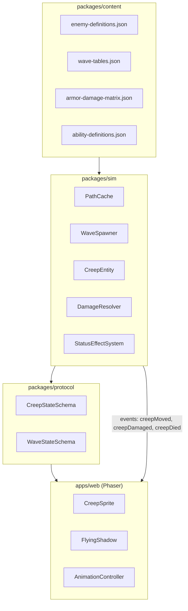
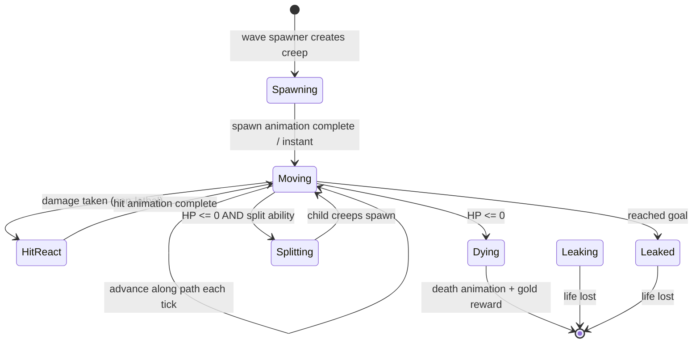
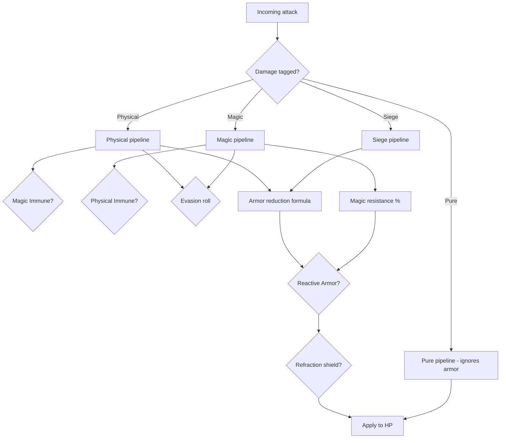

# Monster Systems Deep Dive

Extended reference for **monster movement**, **monster defenses**, and **monster variations** in the Gem TD-inspired tower defense clone (`pb-td`).

This document is the authoritative design spec for creep behavior. It extends [`HANDOVER.md`](./HANDOVER.md) (gameplay loop, pathfinding, combat) and [`PIXELLAB-ASSET-GENERATION.md`](./PIXELLAB-ASSET-GENERATION.md) (archetypes, animation contracts, asset paths). Where this document conflicts with a one-line mention elsewhere, **this document wins** for monster systems.

**Status:** Design specification. Game code (`packages/sim`, `packages/content`, `apps/web`) is not yet committed; schemas and flows here are intended implementation targets.

---

## Table of Contents

1. [Design Philosophy](#1-design-philosophy)
2. [System Architecture](#2-system-architecture)
3. [Monster Movement](#3-monster-movement)
4. [Monster Defenses](#4-monster-defenses)
5. [Monster Variations](#5-monster-variations)
6. [Wave Composition & Progression](#6-wave-composition--progression)
7. [Combat Interaction Matrix](#7-combat-interaction-matrix)
8. [Content Data Schemas](#8-content-data-schemas)
9. [Simulation & Runtime](#9-simulation--runtime)
10. [Presentation Layer (Phaser)](#10-presentation-layer-phaser)
11. [Network Sync (Multiplayer)](#11-network-sync-multiplayer)
12. [Classic Gem TD Fidelity Notes](#12-classic-gem-td-fidelity-notes)
13. [Implementation Checklist](#13-implementation-checklist)
14. [Open Design Decisions](#14-open-design-decisions)

---

## 1. Design Philosophy

Monsters in Gem TD are not generic fodder. They are the **primary puzzle constraint** that makes mazing meaningful. Every movement rule and defensive mechanic exists to force tradeoffs in tower placement, gem selection, and maze shape.

### 1.1 Core Principles

| Principle                        | Meaning                                                                                                                                                        |
| -------------------------------- | -------------------------------------------------------------------------------------------------------------------------------------------------------------- |
| **Mazing is the defense**        | Ground monsters must be slowed by path length. Flying monsters bypass the maze but follow a fixed aerial route that still passes high-value tower zones twice. |
| **Content drives behavior**      | Speed, HP, armor, abilities, and wave tables live in `@facet/content` JSON — never hardcoded in Phaser scenes or attack loops.                                 |
| **Movement ≠ animation**         | Sprites play `walk`/`fly` loops in place. World position advances from simulation tick + content `speed`. Animation FPS is cosmetic only.                      |
| **Announce before punish**       | Wave type, mobility class, and key defensive skills are revealed during the build phase so players can prepare.                                                |
| **Stacking waves are a feature** | Long mazes mean Wave N+1 can spawn while Wave N creeps are still walking. The sim must handle concurrent active creeps from multiple waves.                    |
| **Defense is readable**          | Silhouette, color, and animation cues communicate speed tier, armor tier, flying status, and special abilities without UI labels.                              |

### 1.2 What Makes This Different From Standard TD

Standard tower defense: fixed path, predefined tower slots, linear wave scaling.

Gem TD clone:

- **Waypoint routing** — creeps visit ordered checkpoints, not just Start → End.
- **Player-built path** — rocks and gems reshape the shortest legal route each round.
- **Mobility classes** — ground (maze-affected) vs flying (maze-ignored) on a recurring cadence.
- **Ability-heavy waves** — evasion, immunities, refraction, reactive armor, and more appear on specific waves rather than as random affixes.
- **Anti-defense towers** — Amethyst pierce, Gold corrupt, Quartz anti-fly, and similar gems exist specifically to counter defensive creep skills.

---

## 2. System Architecture

Monster behavior spans four layers. Keep them strictly separated.



### 2.1 Layer Responsibilities

| Layer          | Owns                                                                   | Must NOT own                                       |
| -------------- | ---------------------------------------------------------------------- | -------------------------------------------------- |
| **Content**    | Stat tables, wave schedules, ability definitions, asset key references | Frame-by-frame movement, rendering depth           |
| **Simulation** | Path cache, creep entities, damage math, status effects, wave timing   | Sprite origins, animation FPS, UI gold display     |
| **Protocol**   | Serializable creep/wave state for Colyseus sync                        | Gameplay formulas                                  |
| **Phaser**     | Sprites, animations, interpolation, depth sorting, hit FX              | Authoritative HP, path validity, damage resolution |

---

## 3. Monster Movement

### 3.1 Route Model — Waypoint Mazing

Ground creeps follow an **ordered checkpoint route**. The canonical v1 route (from `HANDOVER.md`) is:

```
Start → Waypoint 1 (center) → Waypoint 2 (top-right) → Waypoint 1 → End
```

This is a simplification of classic Gem TD maps, which often use 5–7 waypoints. The clone should support **N configurable waypoints** in content data; the default board ships with 5 checkpoints (`checkpoint-1` … `checkpoint-5` per asset contract).

#### 3.1.1 Leg Decomposition

The full route decomposes into **legs**. Each leg is an independent A\* query:

| Leg | From            | To              |
| --: | --------------- | --------------- |
|   0 | `spawn`         | `waypoint[0]`   |
|   1 | `waypoint[0]`   | `waypoint[1]`   |
|   … | …               | …               |
| N-1 | `waypoint[N-2]` | `waypoint[N-1]` |
|   N | `waypoint[N-1]` | `goal`          |

**Anti-blocking rule:** During the build phase, when a player hovers a gem/rock placement, temporarily mark that tile blocked and run A\* for **every leg**. If any leg returns `null`, placement is illegal. Players cannot fully seal off a waypoint.

#### 3.1.2 Shortest-Path Behavior

Creeps always take the **shortest walkable path** between consecutive checkpoints. They do not wander, backtrack arbitrarily, or choose alternate routes. Mazing works because blocking tiles force the shortest path to become longer.

Classic Gem TD also has **unbuildable border zones** near spawn walls and diagonal edges where creeps can bypass partial mazes. Model these as permanently blocked _build_ tiles but permanently walkable _path_ tiles in the grid definition.

### 3.2 Pathfinding — EasyStar.js A\*

#### 3.2.1 Grid Representation

```ts
type GridCell = 0 | 1 // 0 = walkable, 1 = blocked (rock, gem, permanent obstacle)

interface BoardGrid {
  width: number
  height: number
  cells: GridCell[] // row-major flat array
  spawn: GridCoord
  goal: GridCoord
  waypoints: GridCoord[] // ordered
  unbuildable: GridCoord[] // cannot place gems/rocks
  forcedWalkable: GridCoord[] // border bypass corridors
}
```

#### 3.2.2 Path Cache (Critical Performance Rule)

> Calculate the path **once** when the maze changes. Save it as an array of world coordinates. Creeps follow array indices.

**Never** run A\* per creep per frame. With 100+ active creeps and 60 ticks/sec, uncached pathfinding will freeze the browser.

```ts
interface PathCache {
  version: number // increments on maze change
  legs: WorldCoord[][] // concatenated when cached
  totalLength: number // sum of leg lengths in world units
  legBoundaries: number[] // index into concatenated path where each leg starts
}
```

**Invalidation triggers:**

- Build phase ends (4 new rocks placed)
- Gem selected and activated as tower (cell remains blocked but type changes — path unchanged unless footprint differs)
- Admin/debug map edit
- NOT: creep death, projectile hit, status slow

#### 3.2.3 Path Following Algorithm

```ts
interface CreepMovementState {
  pathIndex: number // current index into PathCache.legs (concatenated)
  legIndex: number // which waypoint leg
  distanceAlongSegment: number // 0..1 between path[index] and path[index+1]
  facing: 'east' | 'west' // for horizontal flip, not free rotation
}

function advanceCreep(creep: CreepRuntime, path: WorldCoord[], dt: number): void {
  const effectiveSpeed = creep.speed * creep.speedMultiplier // slow/haste
  let remaining = effectiveSpeed * dt

  while (remaining > 0 && creep.pathIndex < path.length - 1) {
    const a = path[creep.pathIndex]
    const b = path[creep.pathIndex + 1]
    const segmentLength = distance(a, b)
    const distLeft = segmentLength * (1 - creep.distanceAlongSegment)

    if (remaining < distLeft) {
      creep.distanceAlongSegment += remaining / segmentLength
      remaining = 0
    } else {
      remaining -= distLeft
      creep.pathIndex++
      creep.distanceAlongSegment = 0
      updateLegIndex(creep)
    }
  }

  creep.worldPos = interpolate(
    path[creep.pathIndex],
    path[creep.pathIndex + 1] ?? path[creep.pathIndex],
    creep.distanceAlongSegment,
  )
}
```

#### 3.2.4 Progress Metric for Targeting

Towers need "closest to end" prioritization. Define **path progress** as a scalar:

```ts
pathProgress = pathIndex + distanceAlongSegment
```

Higher `pathProgress` = closer to goal. When comparing creeps on different waves (different spawn times), use path progress, not Euclidean distance to goal.

### 3.3 Ground vs Flying Movement

| Property                  | Ground                        | Flying                                      |
| ------------------------- | ----------------------------- | ------------------------------------------- |
| **Path source**           | Cached A\* through maze       | Fixed spline: `spawn → … → goal`            |
| **Blocked by rocks/gems** | Yes                           | No                                          |
| **Waypoint legs**         | All legs via pathfinding      | Direct aerial route (may pass center twice) |
| **Animation**             | `walk` loop                   | `fly` loop                                  |
| **Shadow**                | None (ground contact implied) | Separate `shadow.png` sprite, lower depth   |
| **Depth sort**            | `setDepth(sprite.y)`          | `setDepth(sprite.y + FLYING_DEPTH_OFFSET)`  |
| **Typical cadence**       | Most waves                    | Every 4th–5th wave (configurable)           |
| **Counter gems**          | Slow (Sapphire), maze length  | Anti-Air (Amethyst), Quartz anti-fly        |

#### 3.3.1 Flying Route Geometry

Flying creeps ignore the maze but **do not ignore engagement geometry**. Classic Gem TD flies along the gray center path, crossing the map center twice — giving towers two engagement windows.

```ts
interface FlyingRoute {
  id: string
  controlPoints: WorldCoord[] // Catmull-Rom or linear spline
  totalLength: number
}
```

Flying creeps use the same `pathIndex` / `distanceAlongSegment` model, but the path array is computed once per map from `FlyingRoute`, not from A\*.

### 3.4 Speed System

#### 3.4.1 Speed Sources

| Source                   | Applies to        | Example                                 |
| ------------------------ | ----------------- | --------------------------------------- |
| **Base speed** (content) | All               | `crystal-runner`: 320 units/sec         |
| **Wave scaling**         | All               | +3% per wave number                     |
| **Slow debuff**          | Ground + flying   | Sapphire: −60 to −480 MS                |
| **Anti-fly slow**        | Flying only       | Quartz: −150 to −500 MS                 |
| **Rush ability**         | Specific waves    | Burst speed on spawn or at HP threshold |
| **Stone Gaze / root**    | Ground            | Speed → 0 for duration                  |
| **Haste aura**           | Rare (enemy buff) | Multiplier > 1                          |

#### 3.4.2 Speed Tiers (v1 Archetypes)

|     Tier | Archetype        | Relative speed | Design intent                                      |
| -------: | ---------------- | -------------: | -------------------------------------------------- |
|     Fast | `crystal-runner` |          1.35× | Punishes short mazes; dies quickly to focused fire |
| Standard | `stone-grunt`    |          1.00× | Baseline for tuning all other stats                |
|     Slow | `shield-bulwark` |          0.80× | Armored; more tower exposure time                  |
|     Boss | `gate-colossus`  |          0.55× | High HP; long time on path                         |
|   Flying | `sky-warden`     |          1.15× | Faster than standard ground; bypasses maze         |

Absolute values are tuned in content. Start with `stone-grunt` at **270 world-units/sec** on a 32px tile grid and scale from there.

#### 3.4.3 Slow Stacking Rules

To avoid degenerate freeze-lock mazes:

1. **Additive slow cap:** Total slow from all sources cannot reduce speed below **25% of base**.
2. **Diminishing returns:** Each additional slow source after the first applies at **50% strength**.
3. **Slow-immune flag:** Some late waves (e.g. classic "Untouchable" equivalents) ignore slow entirely.
4. **Separate anti-fly slow:** Quartz anti-fly debuff stacks in its own category and applies only to `mobility: flying`.

### 3.5 Creep State Machine



```ts
type CreepLifecycleState =
  | 'spawning' // boss entry animation playing
  | 'moving' // normal path follow
  | 'hit' // brief damage recoil (non-blocking for movement in v1)
  | 'dying'
  | 'splitting'
  | 'leaked'
```

**v1 decision:** Movement continues during `hit` state (hit is cosmetic overlay). Root/stun/gaze abilities set `speedMultiplier = 0` while active.

### 3.6 Wave Spawning & Concurrent Waves

#### 3.6.1 Spawn Timing

```ts
interface WaveSpawnConfig {
  waveNumber: number
  entries: WaveEntry[]
  spawnInterval: number // ms between individual creeps
  groupDelay: number // ms before first creep spawns
  concurrent: boolean // can overlap with prior wave
}

interface WaveEntry {
  enemyId: string
  count: number
  hpMultiplier?: number
  speedMultiplier?: number
}
```

#### 3.6.2 Wave Stacking

If `concurrent: true` (default after wave 10), the spawner does not wait for the prior wave to clear. Each creep tracks its own `waveNumber` for gold rewards and ability scaling, but shares the same `PathCache.version`.

**Leak attribution:** When a creep reaches the goal, deduct lives and attribute the leak to its wave number for analytics.

### 3.7 Special Movement Abilities

Abilities that alter movement (mapped from classic Gem TD):

| Ability ID               | Movement effect                                              | Ground | Flying |
| ------------------------ | ------------------------------------------------------------ | ------ | ------ |
| `blink`                  | Teleport forward along path by X% progress                   | ✓      | ✓      |
| `rush`                   | ×1.5–2.0 speed for 3s on spawn or interval                   | ✓      | ✓      |
| `permanent_invisibility` | No direct movement change; targeting penalty                 | ✓      | ✓      |
| `cloak_and_dagger`       | Invisible until damaged; then normal                         | ✓      | ✓      |
| `disarm`                 | No movement change; disables **tower** attacks in aura range | ✓      | ✓      |
| `stone_gaze`             | Root + massive slow in radius                                | ✓      | —      |

**Blink implementation:** Add `pathIndex += floor(pathLength * blinkFraction)` clamped to path end. Play optional VFX; no collision check needed because path is pre-validated.

---

## 4. Monster Defenses

### 4.1 Defense Model Overview

Monster defenses operate on **three independent axes**:

1. **Raw durability** — HP pool, HP regen (Vitality), boss multipliers.
2. **Damage mitigation** — armor value, armor type, magic resistance, flat reduction.
3. **Special defensive abilities** — evasion, immunities, refraction, reactive armor, kraken shell, untouchable, recharge.



### 4.2 Armor & Damage Types (WC3-Style)

`HANDOVER.md` recommends mapping armor to a JSON multiplier matrix, not hardcoded attack logic. This clone adopts **Warcraft III armor type semantics** as the baseline.

#### 4.2.1 Armor Types

| Armor type  | Typical creeps                               | Character                          |
| ----------- | -------------------------------------------- | ---------------------------------- |
| `unarmored` | Early fodder, split children                 | Takes bonus from most types        |
| `light`     | Fast creeps (`crystal-runner`)               | Weak to pierce/normal              |
| `medium`    | Standard (`stone-grunt`)                     | Neutral baseline                   |
| `heavy`     | Armored (`shield-bulwark`), high-armor waves | Strong vs normal, weak to magic    |
| `fortified` | Boss (`gate-colossus`), structures           | Strong vs pierce, weak to siege    |
| `hero`      | Boss variants, wave 50+                      | Balanced; used for endgame scaling |

#### 4.2.2 Attack Types (from gem/tower damage)

| Attack type | Primary gems                          | Notes                               |
| ----------- | ------------------------------------- | ----------------------------------- |
| `normal`    | Diamond (partial), basic attacks      | Default physical                    |
| `pierce`    | Amethyst                              | Also applies armor reduction debuff |
| `siege`     | Future siege specials                 | Anti-fortified                      |
| `magic`     | Emerald poison ticks, arcane specials | Checks magic resist                 |
| `chaos`     | Rare endgame towers                   | Ignores armor type                  |
| `pure`      | Ruby cleave splash portion            | Ignores armor entirely              |

#### 4.2.3 Damage Multiplier Matrix (baseline)

Values are **percentage modifiers** (100 = normal). Tune in `armor-damage-matrix.json`.

| Attack ↓ / Armor → | Unarmored | Light | Medium | Heavy | Fortified | Hero |
| ------------------ | --------: | ----: | -----: | ----: | --------: | ---: |
| Normal             |       100 |    90 |    100 |   150 |        70 |  100 |
| Pierce             |       150 |   200 |    175 |    75 |        35 |   50 |
| Siege              |       100 |    50 |     75 |   100 |       150 |   50 |
| Magic              |       100 |   125 |    125 |    75 |        35 |   50 |
| Chaos              |       100 |   100 |    100 |   100 |       100 |  100 |
| Pure               |       100 |   100 |    100 |   100 |       100 |  100 |

#### 4.2.4 Armor Value Formula

After type multiplier, apply WC3-style armor reduction:

```ts
function armorDamageMultiplier(armor: number, attackType: AttackType): number {
  if (attackType === 'chaos' || attackType === 'pure') return 1.0

  // WC3: damage * (1 - 0.06 * armor) for positive armor
  // damage * (2 - 0.94^(-armor)) for negative armor (corrupt/pierce debuff)
  if (armor >= 0) {
    return 1 - 0.06 * armor // clamped to min 0.06 (94% reduction cap)
  }
  return 2 - Math.pow(0.94, -armor)
}
```

**Armor debuffs** (Amethyst pierce, Gold corrupt, Paraiba Tourmaline decadent) subtract from armor value before the formula. Minimum armor floor: **−50** (content-tunable).

### 4.3 Magic Resistance

Magic resistance is a **percentage reduction** applied after armor type multiplier for `magic`-tagged damage:

```ts
magicDamageDealt = baseDamage * armorTypeMultiplier * (1 - magicResist / 100)
```

| Creep profile                       |       Typical magic resist |
| ----------------------------------- | -------------------------: |
| Standard ground                     |                         0% |
| `arcane-mystic`                     |                        35% |
| High-resist wave (classic wave 26+) |                     50–75% |
| Boss                                | 25% base, scaling per wave |

**Magic resistance debuffs:** Charming Lazurite anti-fly (−50% MR to flying), Elaborately Carved Tourmaline decadent (−20 MR aura). Debuffs apply before damage calculation.

### 4.4 Special Defensive Abilities

Full catalog mapped from classic Gem TD waves. Each ability is a **composable module** in `ability-definitions.json`.

#### 4.4.1 Evasion

| Property          | Value                                       |
| ----------------- | ------------------------------------------- |
| **Effect**        | Percent chance to negate an attack entirely |
| **Stacks**        | No — take highest source                    |
| **Bypass**        | Monkey King Bar equivalent tower aura       |
| **Classic waves** | 9 (Dusky), 29, 34, 39, 43, 48               |

```ts
if (roll() < creep.evasion) {
  emit('attackMissed', { creepId, towerId })
  return 0
}
```

#### 4.4.2 Magic Immunity / Physical Immunity

| Flag             | Blocks                          | Does not block             |
| ---------------- | ------------------------------- | -------------------------- |
| `magicImmune`    | `magic`, `chaos` (configurable) | `normal`, `pierce`, `pure` |
| `physicalImmune` | `normal`, `pierce`, `siege`     | `magic`, `pure`            |

Some late-game towers gain `ignoreMagicImmune` (Tourmaline line). Check tower flags before immunity.

**Classic waves:** Magic immune — 16, 26, 42, 44, 47. Physical immune — 23, 27, 33, 46.

#### 4.4.3 Refraction (Damage Shield)

Absorbs a **fixed number of attack instances** or **total damage pool** before breaking.

```ts
interface RefractionShield {
  charges: number // e.g. 3 attacks
  damagePool?: number // alternative: 500 total damage
  regenPerSecond?: number
}
```

While active, each hit consumes one charge (or subtracts from pool). Visual: shield shimmer on `shield-bulwark`-style sprites.

**Classic waves:** 14, 23, 29, 31, 41.

#### 4.4.4 Reactive Armor

Each time the creep is hit, it gains **stacking armor and/or HP regen** for a short duration.

```ts
interface ReactiveArmor {
  stacksPerHit: number
  maxStacks: number
  armorPerStack: number
  regenPerStack: number // HP/sec
  stackDuration: number // seconds; refreshes on hit
}
```

**Classic waves:** 24, 28.

#### 4.4.5 Kraken Shell

Blocks **critical strike bonus damage** and reduces **burst damage** over a threshold.

```ts
// If single-hit damage > threshold, reduce excess by 50%
function krakenShellMitigate(damage: number, threshold: number): number {
  if (damage <= threshold) return damage
  return threshold + (damage - threshold) * 0.5
}
```

**Classic waves:** 39, 40, 49.

#### 4.4.6 Untouchable

Reduces attack speed of towers that attack this creep (aura debuff on the **attacker**).

```ts
interface Untouchable {
  radius: number
  attackSpeedReduction: number // e.g. 0.45 = −45% AS to attackers in range
}
```

**Classic waves:** 17, 27, 39, 43, 47.

#### 4.4.7 Vitality (HP Regen)

Passive HP regeneration per second. Strong against poison (DoT) unless burst damage is high.

**Classic waves:** 8, 21, 38.

#### 4.4.8 Recharge (Shield Regen)

Periodically restores refraction charges or a flat HP shield.

**Classic waves:** 32, 43, 49.

#### 4.4.9 High Armor

Not a unique ability — a **flat armor value boost** (+15 to +30) on top of normal typing. Used on waves 22, 25.

#### 4.4.10 Thief / Evasion-Thief

On hit, chance to **steal gold** from the player or **evade and gain brief haste**. Niche; defer to wave 30+ content.

#### 4.4.11 Disarm (Creep Aura)

Creeps with disarm apply a debuff to towers in radius, preventing attacks. This is an **offensive creep ability** that functions as indirect defense.

**Classic waves:** 12, 18, 45, 48.

### 4.5 Status Effect Defenses

| Status                | Applied by        | Resist rule                                            |
| --------------------- | ----------------- | ------------------------------------------------------ |
| **Poison (DoT)**      | Emerald line      | `poisonResist` % reduces tick damage                   |
| **Slow**              | Sapphire line     | `slowResist` %; `slowImmune` flag on untouchable waves |
| **Stun**              | Dark Emerald line | `stunResist` %; bosses halve stun duration             |
| **Burn**              | Ruby/Volcano line | Treated as magic DoT; checks MR                        |
| **Armor corrupt**     | Gold line         | No resist; reduces armor value                         |
| **Root (Stone Gaze)** | Emerald Golem     | `rootImmune` on flying and select bosses               |

### 4.6 Split-on-Death (`thorn-splitter`)

Not armor — but a defensive **pressure mechanic** that punishes overkill.

```ts
interface SplitBehavior {
  childEnemyId: string
  childCount: number
  childHpFraction: number // e.g. 0.35 of parent max HP
  childSpeedMultiplier: number // e.g. 1.2×
  spawnSpread: number // path progress offset for each child
  maxSplitDepth: number // prevent infinite recursion; default 1
}
```

On parent death:

1. Play `split` animation (6–8 frames, one-shot).
2. Spawn `childCount` creeps at parent `worldPos` with slight path progress offsets.
3. Children inherit wave number and gold reward fraction.

---

## 5. Monster Variations

### 5.1 Variation Dimensions

Monsters vary across **seven independent axes**:

```text
Identity = Archetype × WaveScaling × MobilityClass × AbilityLoadout × VisualVariant × SpawnModifier × BossFlag
```

| Axis                | What varies                               | Data source                 |
| ------------------- | ----------------------------------------- | --------------------------- |
| **Archetype**       | Base stats, silhouette, animation set     | `enemy-definitions.json`    |
| **Wave scaling**    | HP/speed/reward multipliers per wave #    | `wave-scaling.json`         |
| **Mobility class**  | Ground vs flying                          | `mobility` field            |
| **Ability loadout** | 0–3 special abilities                     | `wave-tables.json` per wave |
| **Visual variant**  | Palette swap, size, optional skin ID      | `visual-variant` field      |
| **Spawn modifier**  | Group size, interval, concurrent stacking | `WaveSpawnConfig`           |
| **Boss flag**       | Larger scale, spawn anim, HP spike        | `isBoss: true`              |

### 5.2 Archetype Catalog (v1)

Full set from `PIXELLAB-ASSET-GENERATION.md` §6.1:

| ID               | Role             | Mobility | HP tier   | Armor profile     | Speed tier | Special                   |
| ---------------- | ---------------- | -------- | --------- | ----------------- | ---------- | ------------------------- |
| `crystal-runner` | Fast light       | Ground   | Low       | Light, low armor  | Fast       | —                         |
| `stone-grunt`    | Standard         | Ground   | Medium    | Medium            | Standard   | Baseline tuning reference |
| `shield-bulwark` | Armored          | Ground   | High      | Heavy, +armor     | Slow       | Visual shield read        |
| `thorn-splitter` | Splitter         | Ground   | Medium    | Medium            | Standard   | `split` on death          |
| `arcane-mystic`  | Resistant caster | Ground   | Medium    | Medium, +MR       | Standard   | Magic resist profile      |
| `sky-warden`     | Flying           | Flying   | Medium    | Medium            | Fast       | Ignores maze              |
| `gate-colossus`  | Boss             | Ground   | Very high | Fortified, +armor | Slow       | `spawn` entry anim        |

### 5.3 Vertical Slice Subset

First playable slice (PIXELLAB §14):

- `crystal-runner`
- `stone-grunt`
- `shield-bulwark`
- `sky-warden`
- `gate-colossus`

Defer `thorn-splitter` and `arcane-mystic` to slice 2.

### 5.4 Visual Variation Rules

| Variation type     | When used        | Implementation                                        |
| ------------------ | ---------------- | ----------------------------------------------------- |
| **Size scale**     | Boss vs normal   | `renderScale` in content; boss 1.5–2×                 |
| **Palette swap**   | Wave 50+ repeats | Alternate texture key `enemy.stone-grunt.wave50`      |
| **Elite glow**     | Optional affix   | Additive shader or pre-rendered glow layer            |
| **Candidate pick** | Art pipeline     | Multiple PixelLab candidates per batch; one canonical |

Visual variants **never** change hitbox without updating `collisionRadius` in content.

### 5.5 Alternative Wave Opponents

Classic Gem TD rolls **alternative opponents** on some waves (e.g. Baby Panda OR Balloon Badger on a boss wave). Model as:

```ts
interface WaveVariant {
  waveNumber: number
  alternatives: {
    enemyId: string
    weight: number
    abilityOverrides?: AbilityId[]
  }[]
}
```

RNG seed is **per-match deterministic** so multiplayer stays in sync.

### 5.6 Split Children & Summoned Adds

| Type     | Parent                    | Child                      | Depth limit         |
| -------- | ------------------------- | -------------------------- | ------------------- |
| Split    | `thorn-splitter`          | `crystal-runner` (smaller) | 1                   |
| Boss add | `gate-colossus` at 50% HP | `stone-grunt` ×2           | 0 (no nested split) |

---

## 6. Wave Composition & Progression

### 6.1 Classic 50-Wave Structure

Gem TD uses **50 waves** to "beat" the game, then repeats with escalated skills. Boss every **10 waves**. Flying every **~4–5 waves**.

| Wave band | Difficulty | Typical abilities introduced                      |
| --------- | ---------- | ------------------------------------------------- |
| 1–5       | Tutorial   | Pure stats; wave 5 flying                         |
| 6–10      | Early      | Invisibility (8), evasion (9), boss (10)          |
| 11–20     | Mid-early  | Disarm, refraction, magic immune                  |
| 21–30     | Mid        | High armor, physical immune, reactive armor, boss |
| 31–40     | Late       | Blink, recharge, kraken shell, multi-ability      |
| 41–50     | Endgame    | Stacked immunities, untouchable, rush, boss       |

### 6.2 Scaling Formulas (recommended starting point)

```ts
function waveHpMultiplier(wave: number): number {
  return 1 + 0.12 * wave + 0.004 * wave * wave
}

function waveSpeedMultiplier(wave: number): number {
  return 1 + 0.02 * wave
}

function goldRewardMultiplier(wave: number): number {
  return 1 + 0.08 * wave
}
```

Boss waves: additional **×2.5 HP**, **×1.5 gold**.

### 6.3 Flying Wave Cadence

```ts
function isFlyingWave(wave: number): boolean {
  return wave % 5 === 0 // waves 5, 10, 15, 20, ...
}
```

Flying waves spawn **only** `sky-warden` (or flying variants) unless the wave table explicitly mixes.

### 6.4 Wave Announcement Contract

During build phase, UI shows:

```ts
interface WavePreview {
  waveNumber: number
  displayName: string
  mobility: 'ground' | 'flying' | 'mixed'
  abilities: AbilityPreview[] // icons + short labels
  threatLevel: 1 | 2 | 3 | 4 | 5
  isBoss: boolean
}
```

Players must see flying status and immunity icons **before** selecting which gem to keep.

---

## 7. Combat Interaction Matrix

How tower damage types interact with monster defenses (summary for designers).

| Tower/gem line              | Primary counter                    | Weak vs                       |
| --------------------------- | ---------------------------------- | ----------------------------- |
| Amethyst (pierce + corrupt) | High armor, fortified              | Magic immune                  |
| Diamond (raw damage)        | Low armor, medium creeps           | Heavy/fortified               |
| Emerald (poison)            | Vitality regen creeps (slowly)     | Magic immune, high MR         |
| Ruby (splash/pure)          | Grouped creeps, refraction charges | Physical immune               |
| Sapphire (slow)             | Fast creeps                        | Slow-immune, flying (partial) |
| Topaz (multi-target)        | Swarm waves, invisibility groups   | Single high-HP boss           |
| Quartz (anti-fly)           | Flying waves                       | Ground-only waves             |
| Gold (corrupt)              | High armor                         | Low-armor fodder (overkill)   |
| Monkey King Bar tower       | Evasion waves                      | No special counter needed     |

### 7.1 Targeting Priority

From `HANDOVER.md` §6.1 — default sort:

1. Filter: in range AND (if tower is anti-air only → `mobility === flying`).
2. Sort by player preference:
   - **Closest to tower** (Euclidean)
   - **Closest to end** (`pathProgress` descending)
   - **Highest HP**
3. Target first after sort.

**Invisibility:** Excluded from targeting unless revealed (damaged, detection aura, or Monkey King Bar).

---

## 8. Content Data Schemas

### 8.1 Enemy Definition

```ts
// packages/content/src/enemies/enemy-definition.ts

interface EnemyDefinition {
  id: string // kebab-case: "shield-bulwark"
  displayName: string
  archetype: EnemyArchetype
  mobility: 'ground' | 'flying'

  stats: {
    baseHp: number
    baseSpeed: number // world-units per second
    armorType: ArmorType
    baseArmor: number
    magicResist: number // 0-100
    goldReward: number
    lifeCost: number // lives lost on leak
  }

  resistances?: {
    poison?: number
    slow?: number
    stun?: number
  }

  flags?: {
    slowImmune?: boolean
    magicImmune?: boolean
    physicalImmune?: boolean
    rootImmune?: boolean
  }

  behaviors?: {
    split?: SplitBehavior
    onSpawn?: AbilityId[]
  }

  visuals: {
    renderScale: number
    collisionRadius: number
    animations: Record<string, string> // anim key → asset manifest key
    shadowKey?: string // flying only
  }
}

type EnemyArchetype = 'fast' | 'standard' | 'armored' | 'resistant' | 'flying' | 'boss' | 'splitter'
```

### 8.2 Wave Table Entry

```ts
// packages/content/src/waves/wave-definition.ts

interface WaveDefinition {
  waveNumber: number
  displayName: string
  announcement: string // flavor text for UI

  spawn: WaveSpawnConfig

  // Default enemy for all entries unless overridden per entry
  defaultEnemyId: string

  abilities: AbilityId[]

  modifiers?: {
    hpMultiplier?: number
    speedMultiplier?: number
    armorBonus?: number
  }

  isBoss: boolean
  isFlying: boolean

  variants?: WaveVariant // alternative opponent roll
}
```

### 8.3 Ability Definition

```ts
interface AbilityDefinition {
  id: AbilityId
  displayName: string
  description: string
  icon: string // ui icon asset key

  params: Record<string, number | boolean | string>
  tags: ('defensive' | 'offensive' | 'movement')[]
}
```

### 8.4 Example: Wave 25 (Classic "Cosair")

```json
{
  "waveNumber": 25,
  "displayName": "Cosair",
  "announcement": "Flying units with heavy armor. Bring anti-fly and pierce.",
  "defaultEnemyId": "sky-warden",
  "isBoss": false,
  "isFlying": true,
  "abilities": ["high_armor"],
  "modifiers": {
    "armorBonus": 20
  },
  "spawn": {
    "waveNumber": 25,
    "entries": [{ "enemyId": "sky-warden", "count": 12 }],
    "spawnInterval": 800,
    "groupDelay": 2000,
    "concurrent": true
  }
}
```

---

## 9. Simulation & Runtime

### 9.1 Tick Order

Per simulation tick (20–60 Hz, authoritative on server):

```text
1. WaveSpawner.tick()        — spawn new creeps if scheduled
2. For each active creep:
   a. StatusEffectSystem.tick()
   b. MovementSystem.advance()
   c. AbilitySystem.tick()    — reactive armor, recharge, blink timers
3. TowerTargetingSystem      — acquire targets
4. TowerAttackSystem         — fire projectiles
5. ProjectileSystem          — move projectiles
6. DamageResolver            — on impact, apply §4 formulas
7. DeathSystem               — split, gold reward, cleanup
8. LeakDetector              — pathProgress >= pathLength → leak
```

### 9.2 Creep Runtime Entity

```ts
interface CreepRuntime {
  instanceId: string
  enemyId: string
  waveNumber: number

  hp: number
  maxHp: number
  speed: number
  speedMultiplier: number

  pathIndex: number
  distanceAlongSegment: number
  legIndex: number
  pathProgress: number
  worldPos: { x: number; y: number }

  armor: number // current (base + reactive stacks + debuffs)
  magicResist: number
  abilities: ActiveAbility[]

  state: CreepLifecycleState
  mobility: 'ground' | 'flying'

  // Targeting helpers
  isInvisible: boolean
  hasBeenRevealed: boolean
}
```

### 9.3 Damage Resolution Pseudocode

```ts
function resolveDamage(creep: CreepRuntime, attack: AttackPacket): number {
  if (attack.type === 'magic' && creep.flags.magicImmune) return 0
  if (attack.type !== 'magic' && attack.type !== 'pure' && creep.flags.physicalImmune) return 0

  if (roll() < creep.evasion) return 0

  let damage = attack.baseDamage

  if (attack.type !== 'pure' && attack.type !== 'chaos') {
    damage *= armorTypeMatrix[attack.type][creep.armorType]
    damage *= armorDamageMultiplier(creep.armor, attack.type)
  }

  if (attack.type === 'magic') {
    damage *= 1 - creep.magicResist / 100
  }

  if (creep.krakenShell) {
    damage = krakenShellMitigate(damage, creep.krakenShell.threshold)
  }

  if (creep.refraction?.charges > 0) {
    creep.refraction.charges--
    return 0
  }

  return Math.max(0, Math.floor(damage))
}
```

---

## 10. Presentation Layer (Phaser)

### 10.1 Sprite Setup

```ts
// Ground creep
sprite.setOrigin(0.5, 0.75)
sprite.setDepth(sprite.y)

// Flying creep
body.setOrigin(0.5, 0.75)
body.setDepth(sprite.y + 10000)
shadow.setOrigin(0.5, 0.5)
shadow.setDepth(sprite.y - 1) // always below body
```

### 10.2 Animation Controller

| Sim state         | Animation        | Notes                            |
| ----------------- | ---------------- | -------------------------------- |
| `moving` (ground) | `walk` loop      | Speed from sim, not FPS          |
| `moving` (flying) | `fly` loop       | Shadow follows X, fixed Y offset |
| `hit`             | `hit` one-shot   | Can overlay on walk              |
| `dying`           | `death` one-shot | Destroy on complete              |
| `splitting`       | `split` one-shot | Spawn children on frame 3–4      |
| `spawning` (boss) | `spawn` one-shot | Gate-colossus entry              |

### 10.3 Interpolation

Client renders at display refresh; sim may tick at 30 Hz. **Interpolate** between `previousWorldPos` and `worldPos` for smooth movement. Do not interpolate HP — snap on damage events.

### 10.4 Facing

Prefer `sprite.setFlipX(true)` when `worldPos.x` decreases. Do not freely rotate monster sprites.

---

## 11. Network Sync (Multiplayer)

### 11.1 Authoritative State

Server owns: HP, path progress, abilities, wave spawn schedule, RNG seeds.

Client owns: sprite interpolation, animation phase, cosmetic FX.

### 11.2 Minimal Sync Fields

```ts
// @colyseus/schema compatible
class CreepState extends Schema {
  @type('string') instanceId: string
  @type('string') enemyId: string
  @type('number') waveNumber: number
  @type('number') hp: number
  @type('number') pathProgress: number
  @type('number') worldX: number
  @type('number') worldY: number
  @type('string') state: string
  @type('number') armor: number
  @type(['string']) activeAbilityIds: string[]
}
```

### 11.3 Bandwidth Strategy

- Full creep list sync on wave start
- Delta sync: only changed creeps per tick
- Batch death/leak events
- Path cache version sync on maze change (not full path array if deterministic rebuild)

---

## 12. Classic Gem TD Fidelity Notes

| Classic behavior             | Clone implementation                                               |
| ---------------------------- | ------------------------------------------------------------------ |
| 5–7 waypoints, shortest path | Configurable `waypoints[]` + per-leg A\*                           |
| Flying every ~4–5 waves      | `wave % 5 === 0` default                                           |
| Boss every 10 waves          | `isBoss` flag + `gate-colossus`                                    |
| 50 waves then repeat         | `wave > 50` → `effectiveWave = ((wave - 1) % 50) + 1` with scaling |
| Cannot block checkpoints     | Anti-blocking validation on all legs                               |
| Alternative opponents        | `WaveVariant` weighted roll                                        |
| MVP tower bonuses            | Out of scope for this doc; see HANDOVER §attack phase              |
| Gem-type counters            | §7 combat matrix                                                   |

---

## 13. Implementation Checklist

### Phase 1 — Movement Foundation

- [ ] `BoardGrid` with spawn, goal, waypoints, unbuildable zones
- [ ] EasyStar integration with per-leg pathfinding
- [ ] `PathCache` with version invalidation on maze change
- [ ] Anti-blocking validation in build phase
- [ ] `CreepRuntime` path following (ground)
- [ ] Flying route spline (fixed path)
- [ ] Wave spawner with interval timing
- [ ] Concurrent wave support
- [ ] Leak detection + life deduction

### Phase 2 — Defense Foundation

- [ ] `armor-damage-matrix.json`
- [ ] `DamageResolver` with armor type + armor value
- [ ] Magic resistance pipeline
- [ ] Evasion + miss events
- [ ] Magic/physical immunity flags
- [ ] Status effect system (poison, slow, stun)

### Phase 3 — Variations

- [ ] Full `enemy-definitions.json` for vertical slice (5 archetypes)
- [ ] `wave-tables.json` waves 1–25 minimum
- [ ] Boss spawn animation flow
- [ ] Wave announcement UI data contract
- [ ] Wave scaling formulas

### Phase 4 — Advanced Abilities

- [ ] Refraction, reactive armor, kraken shell
- [ ] Blink, rush, untouchable
- [ ] Split-on-death (`thorn-splitter`)
- [ ] Alternative wave opponents
- [ ] Waves 26–50 + repeat scaling

### Phase 5 — Presentation & Sync

- [ ] Phaser creep sprites with animation controller
- [ ] Flying shadow sprites
- [ ] Hit/death/split/spawn animations
- [ ] Colyseus `CreepState` schema
- [ ] Client interpolation

---

## 14. Open Design Decisions

These require team sign-off before implementation:

|   # | Question                             | Options                                           |
| --: | ------------------------------------ | ------------------------------------------------- |
|   1 | Exact waypoint count for default map | 3 (HANDOVER simplified) vs 5–7 (classic)          |
|   2 | Flying wave cadence                  | Every 4 vs every 5 waves                          |
|   3 | Path tick rate                       | 30 Hz sim vs 60 Hz sim                            |
|   4 | Evasion vs RNG feel                  | True random vs pseudo-random per creep            |
|   5 | Split child enemy type               | Always `crystal-runner` vs parent-dependent       |
|   6 | Invisibility reveal duration         | Permanent after first hit vs timed reveal         |
|   7 | Armor formula variant                | WC3 classic vs simplified linear                  |
|   8 | Wave 50+ repeat                      | Full ability remix vs pure stat scaling           |
|   9 | Anti-air tower gate                  | Can non-anti-air target flying at reduced damage? |
|  10 | Disarm aura                          | Disable all towers in radius vs closest N towers  |

---

## Related Documents

| Document                                                         | Relevance                                                         |
| ---------------------------------------------------------------- | ----------------------------------------------------------------- |
| [`HANDOVER.md`](./HANDOVER.md)                                   | Core loop, pathfinding perf, targeting, armor type recommendation |
| [`PIXELLAB-ASSET-GENERATION.md`](./PIXELLAB-ASSET-GENERATION.md) | Archetype art, animation frames, export paths, Phaser manifest    |
| [`CODEX-PIXELLAB-MCP.md`](./CODEX-PIXELLAB-MCP.md)               | MCP wiring for asset generation                                   |

---

_Last updated: design spec for `pb-td` v0.2.x. Update this document when `packages/content` schemas land in the repo._
