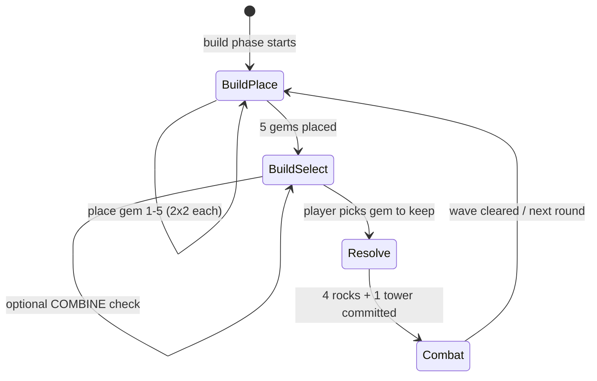
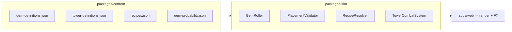

# Tower and Gem Systems Specification

Authoritative design for **gems**, **towers**, **recipes**, **combat abilities**, and **player build-phase economy** in the Gem TD-inspired clone (`pb-td`).

Extends [`HANDOVER.md`](./HANDOVER.md) §2.1–2.2, §6–7 and ties into [`BOARD-AND-MAZE-SPEC.md`](./BOARD-AND-MAZE-SPEC.md) (2×2 footprints, blocking). Monster-side defenses and damage resolution are covered in [`MONSTER-SYSTEMS-DEEP-DIVE.md`](./MONSTER-SYSTEMS-DEEP-DIVE.md) when available.

**Status:** Design specification. `packages/content` and combat sim code are not yet committed.

---

## Table of Contents

1. [Design goals](#1-design-goals)
2. [Classic Gem TD reference](#2-classic-gem-td-reference)
3. [System overview](#3-system-overview)
4. [Gem types and qualities](#4-gem-types-and-qualities)
5. [Build phase: place, select, resolve](#5-build-phase-place-select-resolve)
6. [Tower activation and rocks](#6-tower-activation-and-rocks)
7. [Combine and recipe system](#7-combine-and-recipe-system)
8. [Combat stats and scaling](#8-combat-stats-and-scaling)
9. [Abilities and effects](#9-abilities-and-effects)
10. [Targeting and tower control](#10-targeting-and-tower-control)
11. [MVP system](#11-mvp-system)
12. [Auras and stacking](#12-auras-and-stacking)
13. [Damage types and monster interaction](#13-damage-types-and-monster-interaction)
14. [Gem probability upgrades](#14-gem-probability-upgrades)
15. [Content data schemas](#15-content-data-schemas)
16. [Art and asset ID mapping](#16-art-and-asset-id-mapping)
17. [Vertical slice scope](#17-vertical-slice-scope)
18. [Open decisions](#18-open-decisions)

---

## 1. Design goals

| Goal                        | Spec                                                                              |
| --------------------------- | --------------------------------------------------------------------------------- |
| **Gems are the maze**       | Unselected gems become rocks; selected gems become towers — both block paths.     |
| **RNG with agency**         | Random gem rolls, but player chooses placement and which gem to keep.             |
| **Type = role**             | Each of 8 gem types has a distinct combat identity (slow, splash, poison, etc.).  |
| **Quality = power**         | Tier upgrades stats and ability potency within a type.                            |
| **Recipes reward planning** | Combining specific gems/towers creates special towers with unique kits.           |
| **Content-driven**          | All stats, recipes, and ability params live in JSON — not hardcoded in Phaser.    |
| **Readable at scale**       | On a grass board with hundreds of structures, silhouette and color identify type. |

---

## 2. Classic Gem TD reference

| Mechanic       | Classic behavior                                     | Clone adoption                                              |
| -------------- | ---------------------------------------------------- | ----------------------------------------------------------- |
| Base gem types | **8** types × **6** quality levels                   | Same 8 types; 6 qualities + optional **Great** tier         |
| Placement      | **5** gems per build round, **2×2** each             | Same                                                        |
| Selection      | Keep **1** as tower; **4** become rocks              | Same                                                        |
| Combine        | 3 specific gems/towers → special tower               | Same pattern; v1 ships subset of recipes                    |
| Range          | ~500 base units (varies by tower)                    | **160 px** base at tier 1 (5 tiles @ 32px), scales per tier |
| Attack speed   | Type-dependent (Aquamarine fastest)                  | Defined per gem in content                                  |
| MVP            | Top damage tower per round gets buff; 10 MVPs → aura | Adopt simplified v1 MVP (see §11)                           |
| Manual control | Stop/hold fire, focus targeting                      | v1: targeting mode + hold fire                              |
| Aura stacking  | Same aura level does not stack                       | Enforce by aura `stackGroup`                                |

**Gem type letters (classic):** Amethyst **P**, Aquamarine **Q**, Diamond **D**, Emerald **G**, Opal **E**, Ruby **R**, Sapphire **B**, Topaz **Y**.

---

## 3. System overview





### 3.1 Entity kinds on the board

| Kind              | Created when            |  Blocks path  | Attacks |
| ----------------- | ----------------------- | :-----------: | :-----: |
| **Placement gem** | Build — before select   | ✓ (temporary) |    ✗    |
| **Tower**         | Resolve — chosen gem    |       ✓       |    ✓    |
| **Rock**          | Resolve — unchosen gems |       ✓       |    ✗    |
| **Special tower** | Combine recipe          |       ✓       |    ✓    |

All structures use **2×2** footprints per [`BOARD-AND-MAZE-SPEC.md`](./BOARD-AND-MAZE-SPEC.md).

---

## 4. Gem types and qualities

### 4.1 The eight gem types

| ID           | Classic name | Color       | Combat role                      | Attack type              | Primary counter             |
| ------------ | ------------ | ----------- | -------------------------------- | ------------------------ | --------------------------- |
| `amethyst`   | Amethyst     | Violet      | Armor pierce / corrupt           | `pierce`                 | High armor, fortified       |
| `aquamarine` | Aquamarine   | Cyan        | Attack speed (self + aura later) | `normal`                 | Single-target DPS checks    |
| `diamond`    | Diamond      | White/clear | Raw high damage                  | `normal`                 | Medium creeps, bosses       |
| `emerald`    | Emerald      | Green       | Poison DoT                       | `magic`                  | High HP, regen (vitality)   |
| `opal`       | Opal         | Iridescent  | Attack speed aura                | `normal`                 | Supporting maze DPS         |
| `ruby`       | Ruby         | Red         | Splash / cleave (`pure` portion) | `normal` + `pure` splash | Grouped waves               |
| `sapphire`   | Sapphire     | Blue        | Slow                             | `magic`                  | Fast creeps, flying         |
| `topaz`      | Topaz        | Yellow      | Multi-target split shot          | `normal`                 | Swarms, invisibility groups |

### 4.2 Quality tiers

| Tier | ID              | Classic prefix | Relative power              | Roll weight (start)   |
| ---: | --------------- | -------------- | --------------------------- | --------------------- |
|    1 | `chipped`       | ×1             | Baseline                    | 100% at prob level 1  |
|    2 | `flawed`        | ×2             | +~80% stats                 | Unlocked via upgrades |
|    3 | `normal`        | ×3             | +~60% over flawed           |                       |
|    4 | `flawless`      | ×4             | Strong mid-game             |                       |
|    5 | `perfect`       | ×5             | Late-game                   |                       |
|    6 | `great`         | ×6             | Rare peak tier              | Very low weight       |
|    — | `great` (named) | Great          | Event/quest only (optional) | Defer post-v1         |

**Canonical gem ID:** `{type}-{quality}` — e.g. `ruby-flawless`, `sapphire-chipped`.

### 4.3 Gem object (pre-tower)

During placement, a gem is not yet a tower:

```ts
interface PlacedGem {
  instanceId: string
  gemId: string // "emerald-normal"
  grid: { gx: number; gy: number } // 2x2 top-left, even-aligned
  phase: 'placed' | 'selected' | 'consumed' | 'rock'
}
```

---

## 5. Build phase: place, select, resolve

### 5.1 Place (5 gems)

1. Roll gem type + quality from probability table (§14).
2. Player positions each gem on legal 2×2 cells (anti-block validation).
3. Repeat until **5** placements consumed for the round.

Optional skills (classic, defer v1): gem-type pray, quality pray, timelapse reroll.

### 5.2 Select (keep 1)

Player clicks one placed gem to **keep**. UI highlights selection; others preview as rocks.

During select, if board satisfies a **recipe**, show **COMBINE** action (§7).

### 5.3 Resolve

| Placed gem | Result                                                      |
| ---------- | ----------------------------------------------------------- |
| Selected   | Becomes **tower** at same footprint; play `build` animation |
| Other 4    | Become **rocks** permanently                                |

Path cache invalidates after resolve. Gold income from prior wave already applied.

### 5.4 Combine timing

Classic allows combine **during build phase** before or instead of simple select:

- If recipe components are on board → player triggers **COMBINE** on the output anchor tile.
- Component gems/towers are consumed.
- Output special tower spawns at anchor footprint.

**v1:** Combine available in select subphase only (not mid-combat).

---

## 6. Tower activation and rocks

### 6.1 Tower runtime

```ts
interface TowerInstance {
  instanceId: string
  towerId: string // "diamond-normal" or "silver" (special)
  grid: { gx: number; gy: number }
  world: { x: number; y: number }

  stats: TowerCombatStats // resolved from content + MVP + auras
  state: 'idle' | 'attacking' | 'held' // held = player disabled fire

  mvpCount: number
  targetingMode: TargetingMode
  lastAttackAt: number
}
```

### 6.2 Rock

```ts
interface RockInstance {
  instanceId: string
  grid: { gx: number; gy: number }
  assetKey: 'env.rock'
}
```

Rocks are passive blockers — no HP, no interaction. One rock sprite regardless of source gem type (classic).

### 6.3 Footprint rules

- Tower and rock occupy identical **2×2** `blocked` cells.
- Replacing a placement gem does not change footprint position.
- Combine may require anchor gem position to remain stable.

---

## 7. Combine and recipe system

### 7.1 Recipe shape

```ts
interface RecipeDefinition {
  id: string // "silver"
  displayName: string
  tier: 'basic' | 'intermediate' | 'advanced' | 'top' | 'secret'

  inputs: RecipeInput[] // exactly 3 for standard recipes
  outputTowerId: string

  // If all 3 placed in ONE build round → instant combine offered
  instantCombineInSingleRound: boolean
}

type RecipeInput =
  | { kind: 'gem'; gemId: string } // "sapphire-chipped"
  | { kind: 'tower'; towerId: string } // "silver"
```

### 7.2 Resolution algorithm

```ts
function findAvailableRecipes(board: BoardState): RecipeDefinition[] {
  return recipes.filter((r) => r.inputs.every((input) => board.has(input)))
}

function applyRecipe(
  board: BoardState,
  recipe: RecipeDefinition,
  anchorGx: number,
  anchorGy: number,
) {
  for (const input of recipe.inputs) board.consume(input)
  board.placeTower(recipe.outputTowerId, anchorGx, anchorGy)
}
```

Inputs must be **exact** tier and type unless recipe specifies `tower` lineage (e.g. Silver Knight requires **Silver** tower, not raw gems).

### 7.3 v1 recipe catalog (ship first)

| Output            | Tier  | Inputs                                                    | Notes                  |
| ----------------- | ----- | --------------------------------------------------------- | ---------------------- |
| `silver`          | basic | `sapphire-chipped` + `diamond-chipped` + `topaz-chipped`  | Slow + damage baseline |
| `malachite`       | basic | `opal-chipped` + `emerald-chipped` + `aquamarine-chipped` | Multi-target 4         |
| `quartz`          | basic | `emerald-flawless` + `ruby-normal` + `amethyst-flawed`    | Anti-fly debuff        |
| `jade`            | basic | `emerald-normal` + `opal-normal` + `sapphire-flawed`      | Strong poison          |
| `asteriated-ruby` | basic | `ruby-flawed` + `ruby-chipped` + `amethyst-chipped`       | Burn aura              |

### 7.4 Slice 2+ recipes (defer)

| Output            | Tier         | Inputs                                                   |
| ----------------- | ------------ | -------------------------------------------------------- | ------------- |
| `silver-knight`   | intermediate | `silver` + `aquamarine-flawed` + `ruby-normal`           |
| `pink-diamond`    | intermediate | `diamond-perfect` + `diamond-normal` + `topaz-normal`    |
| `vivid-malachite` | intermediate | `malachite` + `diamond-flawed` + `topaz-normal`          |
| `volcano`         | intermediate | `asteriated-ruby` + `ruby-flawless` + `amethyst-normal`  |
| `gold`            | intermediate | `amethyst-perfect` ×2 + `diamond-flawed`                 | Corrupt armor |
| `dark-emerald`    | intermediate | `emerald-perfect` + `sapphire-flawless` + `topaz-flawed` | Stun chance   |

Full classic catalog (50+ specials) lives in `recipes-full.json` — import incrementally.

### 7.5 Recipe UI (React)

- **Recipe dictionary** panel: browsable list with owned/hint states.
- On board match: pulse **COMBINE** on valid anchor gems.
- Show consumed components preview before confirm.

---

## 8. Combat stats and scaling

### 8.1 Core stats

```ts
interface TowerCombatStats {
  range: number // pixels (world space)
  baseDamage: number // per primary hit
  attackInterval: number // seconds between attacks
  projectileSpeed?: number // pixels/sec; omit for instant ray
  targets: number // 1 default; topaz splits higher

  critChance?: number
  critMultiplier?: number
}
```

### 8.2 Range convention

Classic Gem TD treats range as a large internal value (~500). This project maps to pixels on a **32px tile** grid:

| Reference     |  Pixels | Tiles (approx.) |
| ------------- | ------: | --------------: |
| Tier 1 base   |     160 |               5 |
| Tier 3 mid    |     200 |            6.25 |
| Special basic |     240 |             7.5 |
| Advanced      | 280–320 |            9–10 |
| Top / siege   |    400+ |           12.5+ |

**Rule of thumb:** 1 tile ≈ 32px ≈ classic “one range unit” for player intuition (per SC2 Gem TD wiki).

### 8.3 Base stat tables (tier 1 — chipped)

Tuned from classic P1/Q1/D1… values, scaled to clone units:

| Gem ID               | Range | Damage | Interval (s) | Targets | Notes                  |
| -------------------- | ----: | -----: | -----------: | ------: | ---------------------- |
| `amethyst-chipped`   |   160 |      2 |         0.60 |       1 | + pierce 2 armor       |
| `aquamarine-chipped` |   128 |      2 |         0.25 |       1 | High AS baseline       |
| `diamond-chipped`    |   160 |      5 |         1.00 |       1 | Pure damage focus      |
| `emerald-chipped`    |   160 |      2 |         1.00 |       1 | + poison 2 DPS × 5s    |
| `opal-chipped`       |   160 |      1 |         1.00 |       1 | Aura +20 AS (§12)      |
| `ruby-chipped`       |   160 |      4 |         1.00 |       1 | 30% pure splash @ 96px |
| `sapphire-chipped`   |   192 |      2 |         1.00 |       1 | Slow −60 speed         |
| `topaz-chipped`      |   192 |      3 |         1.30 |       3 | Split shot             |

### 8.4 Quality scaling multipliers

Apply per stat category:

| Quality  | Damage | DoT / debuff | Range | Attack speed |
| -------- | -----: | -----------: | ----: | -----------: |
| chipped  |   1.00 |         1.00 |  1.00 |         1.00 |
| flawed   |   2.00 |         1.75 |  1.00 |         1.00 |
| normal   |   3.00 |         2.50 |  1.05 |         1.00 |
| flawless |   4.50 |         3.50 |  1.10 |         1.05 |
| perfect  |   7.00 |         5.00 |  1.15 |         1.10 |
| great    |  12.00 |         8.00 |  1.20 |         1.15 |

```ts
function resolveStats(gemId: string): TowerCombatStats {
  const base = gemBaseTable[gemId]
  const quality = parseQuality(gemId)
  return applyMultipliers(base, qualityMultipliers[quality])
}
```

### 8.5 Special tower stat overrides

Special towers **replace** base gem stats entirely (do not stack on prior gem). See `tower-definitions.json` per ID.

**Example — `silver` (basic):**

| Stat     |            Value |
| -------- | ---------------: |
| Range    |              192 |
| Damage   |               40 |
| Interval |            1.00s |
| Slow     | −90 speed on hit |

---

## 9. Abilities and effects

Abilities are modular effect blocks attached to gem/tower definitions.

```ts
type TowerAbility =
  | { type: 'pierce'; armorReduction: number }
  | { type: 'corrupt'; armorReduction: number }
  | { type: 'slow'; speedReduction: number; duration?: number }
  | { type: 'poison'; dps: number; duration: number }
  | { type: 'cleave'; percent: number; radius: number; damageType: 'pure' }
  | { type: 'split_shot'; targets: number }
  | { type: 'burn'; dps: number; radius: number }
  | { type: 'anti_fly'; armorReduction: number; speedReduction: number; mrReduction?: number }
  | { type: 'stun'; chance: number; duration: number }
  | { type: 'chain_lightning'; chance: number; jumps: number; damage: number }
  | { type: 'aura_attack_speed'; bonus: number; radius: number; stackGroup: string }
  | { type: 'aura_range'; bonus: number; radius: number }
  | { type: 'inspire'; damagePercent: number; radius: number }
  | { type: 'monkey_king_bar'; radius: number } // true strike vs evasion
  | {
      type: 'decadent'
      armorReduction: number
      mrReduction: number
      radius: number
      ignoreMagicImmune?: boolean
    }
```

### 9.1 Per-type ability progression

| Type       | Tier 1 ability    | Max tier (classic ref)         |
| ---------- | ----------------- | ------------------------------ |
| Amethyst   | Pierce −2 armor   | Pierce −64 armor               |
| Aquamarine | Self AS +200      | AS +500, faster interval       |
| Diamond    | —                 | +320 bonus damage (D6)         |
| Emerald    | Poison 2 DPS / 5s | Poison 128 DPS / 5s            |
| Opal       | Aura +20 AS       | Aura +70 AS                    |
| Ruby       | Cleave 30% @ 300  | Cleave 100% @ 700              |
| Sapphire   | Slow −60          | Slow −480 + small AoE slow     |
| Topaz      | 3 targets         | 3 targets (Y6 adds huge range) |

### 9.2 Effect application order

On projectile impact:

```text
1. Hit roll (evasion, miss)
2. Immunity checks (magic / physical)
3. Primary damage + armor/MR
4. On-hit debuffs (slow, pierce, corrupt)
5. DoT application (poison, burn)
6. Splash / cleave (secondary targets)
7. Chain lightning proc roll
8. MVP damage credit
```

### 9.3 Projectile vs instant

| Delivery        | Used by                 | Sim                                       |
| --------------- | ----------------------- | ----------------------------------------- |
| **Projectile**  | Most gems               | Arcade `moveToObject`, impact radius 10px |
| **Instant ray** | Optional diamond tier 6 | Immediate damage after attack anim frame  |
| **Aura tick**   | Burn, decadent          | Periodic AoE pulse from tower center      |

---

## 10. Targeting and tower control

### 10.1 Targeting modes

```ts
type TargetingMode =
  | 'closest_to_tower'
  | 'closest_to_goal' // uses creep pathProgress
  | 'highest_hp'
  | 'first_in_range'
```

Default: **`closest_to_goal`** (classic maze optimization).

Player can set per-tower or global default in UI.

### 10.2 Target filter pipeline

```ts
function acquireTarget(tower: TowerInstance, creeps: CreepRuntime[]): CreepRuntime | null {
  let candidates = creeps.filter((c) => inRange(tower, c) && c.state === 'moving')

  if (tower.requiresAntiAir && c.mobility === 'flying') {
    /* amethyst anti-air gate — see §13 */
  }
  if (c.isInvisible && !c.hasBeenRevealed && !tower.hasTrueStrike) candidates = exclude(c)

  return sortByMode(candidates, tower.targetingMode)[0] ?? null
}
```

### 10.3 Multi-target (Topaz / Malachite)

- `split_shot`: acquire N distinct targets in range; one projectile each.
- If fewer than N creeps, duplicate shots on available targets or leave unused — **v1: no duplicate**, fire at all available.

### 10.4 Player control (classic)

| Action             | Effect                                 |
| ------------------ | -------------------------------------- |
| **Hold fire**      | Tower `state = held'` — no acquisition |
| **Resume**         | Returns to `idle`                      |
| **Targeting mode** | Per-tower dropdown                     |

Defer: manual focus fire on specific creep.

### 10.5 Rotation

Towers rotate toward target per `HANDOVER.md` §6.2. Support-type towers (Opal aura) may omit rotation — idle pulse only.

---

## 11. MVP system

Classic MVP rewards the tower dealing the most damage each combat round.

### 11.1 v1 MVP rules

| Event                              | Effect                                                            |
| ---------------------------------- | ----------------------------------------------------------------- |
| Highest damage tower **this wave** | +1 MVP stack (max 10)                                             |
| Each MVP stack                     | +10% damage on that tower                                         |
| Each MVP stack                     | Enemies within 64px take −10% MR (debuff)                         |
| **10 MVP stacks**                  | Unlock **MVP Aura**: +75% damage to allies within 192px (6 tiles) |

### 11.2 MVP tracking

```ts
interface MvpTracker {
  damageByTower: Map<string, number>
  mvpStacks: Map<string, number> // tower instanceId → 0..10
}
```

Reset damage counters each wave; MVP stacks persist entire match.

### 11.3 Player strategy hook

Players **hold fire** on strong towers early in a wave to feed MVP to a carry tower — classic advanced play. Document in tutorial.

---

## 12. Auras and stacking

### 12.1 Aura types

| Aura         | Source                            | Effect                                     |
| ------------ | --------------------------------- | ------------------------------------------ |
| Attack speed | Opal, Aquamarine (late), specials | +flat AS to allies in radius               |
| Range        | Grey Jade line                    | +range px                                  |
| Inspire      | Cat's Eye line                    | +% damage                                  |
| Resist       | Deepsea Pearl line                | Towers resist disarm/slow (defer mechanic) |
| MVP          | 10-stack tower                    | +75% damage                                |

### 12.2 Stacking rules (classic)

```ts
function resolveAuraBonus(tower: TowerInstance, sources: AuraSource[]): number {
  // Same stackGroup + same tier → only highest applies
  // Different stackGroups → sum
  // Example: two Opal E2 auras DO NOT stack; E2 + E4 → use E4 only
}
```

| stackGroup           | Stacks with                     |
| -------------------- | ------------------------------- |
| `opal_attack_speed`  | Higher tier only (same group)   |
| `aquamarine_self_as` | Self only                       |
| `mvp_aura`           | Unique per tower with 10 stacks |
| `inspire_damage`     | Highest % only                  |

### 12.3 Aura radius

Default aura radius: **160px** (5 tiles). Advanced towers: **192–320px**.

---

## 13. Damage types and monster interaction

Cross-reference monster armor in [`MONSTER-SYSTEMS-DEEP-DIVE.md`](./MONSTER-SYSTEMS-DEEP-DIVE.md).

| Gem / tower    | Primary damage type      | Splash type     |
| -------------- | ------------------------ | --------------- |
| Amethyst       | `pierce`                 | —               |
| Diamond        | `normal`                 | —               |
| Emerald poison | `magic`                  | —               |
| Ruby hit       | `normal`                 | `pure` (cleave) |
| Sapphire slow  | `magic` (minimal damage) | —               |
| Topaz          | `normal`                 | —               |
| Burn auras     | `magic`                  | —               |

**Anti-air:** Amethyst and Quartz lines apply extra debuffs to `mobility: flying`. v1: all towers **can** target flying creeps; anti-air gems are counter picks via debuffs, not hard target restriction.

**True strike:** `monkey_king_bar` aura ignores evasion.

**Ignore magic immune:** `decadent` (Tourmaline line) — only when `ignoreMagicImmune: true`.

---

## 14. Gem probability upgrades

Player spends gold to raise **Gem Probability Level** (React UI → sim).

### 14.1 Quality weights (from HANDOVER)

| Level | Chipped | Flawed | Normal | Flawless | Perfect | Great |
| ----: | ------: | -----: | -----: | -------: | ------: | ----: |
|     1 |    100% |     0% |     0% |       0% |      0% |    0% |
|     2 |     70% |    30% |     0% |       0% |      0% |    0% |
|     3 |     40% |    40% |    20% |       0% |      0% |    0% |
|     4 |     25% |    35% |    25% |      15% |      0% |    0% |
|     5 |     15% |    25% |    30% |      20% |     10% |    0% |
|     6 |     10% |    20% |    25% |      25% |     15% |    5% |

_Extend table in `gem-probability.json`; levels 4–6 are proposed for clone._

### 14.2 Type roll

Uniform 1/8 per type at v1. Future: **gem pray** skill biases one type (+40% weight).

```ts
function rollGem(level: number, bias?: GemType): GemRoll {
  const type = weightedTypeRoll(bias)
  const quality = weightedQualityRoll(level)
  return { gemId: `${type}-${quality}` }
}
```

---

## 15. Content data schemas

### 15.1 Gem definition

```ts
// packages/content/src/gems/gem-definition.ts

interface GemDefinition {
  id: string // "ruby-flawless"
  type: GemType
  quality: QualityTier
  displayName: string

  combat: TowerCombatStats
  abilities: TowerAbility[]
  projectileKey?: string
  assetKey: string // "tower.ruby.flawless.idle"

  footprint: 2
  blocksPath: true
}
```

### 15.2 Tower definition (special)

```ts
interface TowerDefinition {
  id: string // "silver"
  displayName: string
  classification: 'basic' | 'intermediate' | 'advanced' | 'top' | 'secret'

  combat: TowerCombatStats
  abilities: TowerAbility[]
  projectileKey?: string
  assetKey: string

  recipeId?: string // back-link
  footprint: 2
}
```

### 15.3 File layout

```text
packages/content/src/
  gems/
    base-stats.json           # per-type tier-1 templates
    quality-multipliers.json
    definitions/              # generated or hand-authored 48 base gems
  towers/
    special/                  # silver.json, malachite.json, ...
  recipes/
    v1-recipes.json
    recipes-full.json         # classic catalog (import later)
  economy/
    gem-probability.json
```

### 15.4 Example gem JSON

```json
{
  "id": "sapphire-flawed",
  "type": "sapphire",
  "quality": "flawed",
  "displayName": "Flawed Sapphire",
  "combat": {
    "range": 160,
    "baseDamage": 4,
    "attackInterval": 1.0,
    "targets": 1
  },
  "abilities": [{ "type": "slow", "speedReduction": 90 }],
  "projectileKey": "projectile.arcane-lance",
  "assetKey": "tower.sapphire.flawed"
}
```

---

## 16. Art and asset ID mapping

Gameplay uses **8 canonical gem types**. Art pipeline may batch by **visual family** (see [`PIXELLAB-ASSET-GENERATION.md`](./PIXELLAB-ASSET-GENERATION.md)).

| Canonical type | Art family (PixelLab)    | Color cue         |
| -------------- | ------------------------ | ----------------- |
| `ruby`         | `flame`                  | Red / orange      |
| `diamond`      | `stone`                  | White / grey-gold |
| `emerald`      | `thorn`                  | Green             |
| `amethyst`     | `arcane`                 | Violet            |
| `opal`         | `radiant`                | Gold / prismatic  |
| `sapphire`     | `arcane` (cool variant)  | Blue              |
| `topaz`        | `radiant` (warm variant) | Yellow            |
| `aquamarine`   | `stone` (cool variant)   | Cyan              |

Content `assetKey` points to manifest entry; manifest may reuse family sprites with **tint** for type distinction in v1 if needed.

**Special tower art:** Unique sprites (`silver`, `malachite`, `magma-core` / `volcano`) — not recolors of base gems.

---

## 17. Vertical slice scope

### 17.1 Ship in v1

| Category           | Scope                                                              |
| ------------------ | ------------------------------------------------------------------ |
| **Gem types**      | All 8 types                                                        |
| **Qualities**      | chipped, flawed, normal (prob levels 1–3)                          |
| **Special towers** | `silver`, `malachite`, `quartz`                                    |
| **Recipes**        | 3 basic recipes above                                              |
| **Abilities**      | pierce, slow, poison, cleave, split_shot, anti_fly, aura AS (opal) |
| **MVP**            | Simplified §11                                                     |
| **Control**        | 3 targeting modes + hold fire                                      |

### 17.2 Slice 2

- Qualities flawless / perfect / great
- Recipes: `silver-knight`, `jade`, `asteriated-ruby`, `volcano`, `gold`
- Chain lightning, stun, burn, corrupt
- Full MVP aura at 10 stacks

### 17.3 Slice 3

- Top-tier towers (Koh-i-noor, Diamond Cullinan, etc.)
- Secret towers
- Gem pray / skills economy

---

## 18. Open decisions

|   # | Question                                             | Recommendation                            |
| --: | ---------------------------------------------------- | ----------------------------------------- |
|   1 | Anti-air hard gate vs debuff-only                    | Debuff-only for v1                        |
|   2 | 48 separate gem sprites vs family tint               | Family base + quality scale; tint by type |
|   3 | Instant combine when 3 recipe gems placed same round | Yes — classic QoL                         |
|   4 | Rock sprite variety by source gem                    | No — single `env.rock`                    |
|   5 | Tower sell / undo                                    | No — classic has no sell                  |
|   6 | Range shown as tile rings in UI                      | Optional build-phase toggle               |
|   7 | Aquamarine aura vs self-only AS                      | Self-only v1; aura in slice 2             |

---

## Related documents

| Document                                                         | Relevance                                   |
| ---------------------------------------------------------------- | ------------------------------------------- |
| [`HANDOVER.md`](./HANDOVER.md)                                   | Core loop, combat basics, probability table |
| [`BOARD-AND-MAZE-SPEC.md`](./BOARD-AND-MAZE-SPEC.md)             | 2×2 placement, rocks block path             |
| [`PIXELLAB-ASSET-GENERATION.md`](./PIXELLAB-ASSET-GENERATION.md) | Tower sprites, projectiles, FX              |
| [`ASSET-GENERATION-TRACKER.md`](./ASSET-GENERATION-TRACKER.md)   | Per-tower asset checklist                   |
| [`MONSTER-SYSTEMS-DEEP-DIVE.md`](./MONSTER-SYSTEMS-DEEP-DIVE.md) | Armor, MR, immunities                       |

---

## Changelog

| Date       | Change                                                                             |
| ---------- | ---------------------------------------------------------------------------------- |
| 2026-06-30 | Initial spec: 8 gem types, 6 qualities, recipes, combat stats, MVP, auras, schemas |
